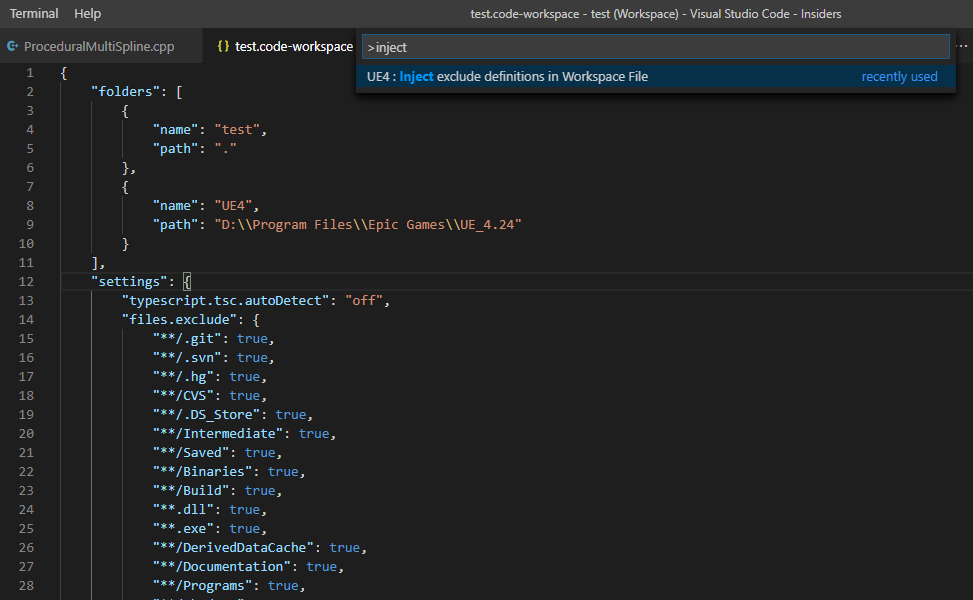

In this section, I will walk you through installing and configuring the extension. I am assuming that you have a working copy of VSCode or VSCode Insiders.

If you had any trouble setting those up, please read through here first.

### Step 1: Installing the plug-in

---

The option to manually install an extension can be found from the extensions tab in the
sidebar as shown below

After selecting the `.vsix` file, you might be asked to restart your editor. 
Do so and then you can find the extension listed along any other extensions which can be accessed from the sidebar as shown below

### Step 2.1: Basic Configuration (Programming) 

---

I will assume that you already have a `.code-workspace` file in your project directory. 
Keep in mind to start the workspace using that file *(Avoid right click --> Open with VSCode)* 

The very first thing to do is to run `UE4 : Inject Workspace definitions in Workspace file` from the command palette.

This will inject a lot of config options into your `.code-workspace` that willimprove your intellisense parsing.
The new workspace file should look like the following.

Restart the editor. Everytime you regenerate the project, run the same command again to get the configs.
You have to restart the editor once after running command for all configs to be applied properly. 

### Step 2.2: Basic Configuration (Asset Management)

---

For using the asset management tools, no C++ is required. Following links will guide you through setting up and configuring your first **Asset Stream**. 

See you later... 🖐