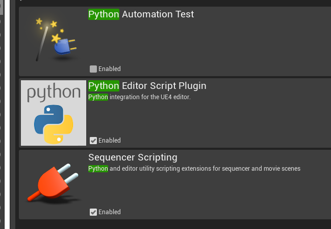
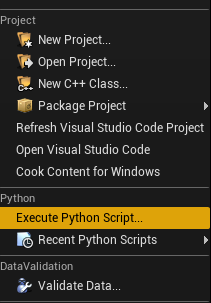
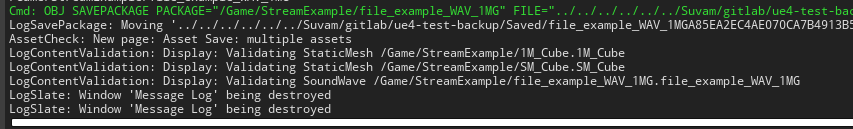

Next up I want you to open the engine.
Go to Edit --> Plugins --> Activate the python plug-in and restart.



Next time you open it, the execute python script menu option should be available like this.



But we are not done yet. We need to play with some settings and actually generate the asset data.

### Settings

---

Settings are read when `UE4 : Refresh Asset Folders` is called. The settings might look different from the screenshots (new stuff get added frequently),
We want to fix the following settings.

```json
	"targetPath": "/Game/StreamExample",
	"createMaterials": false,
	"importTexturesForMesh": false,
	"auto_generate_lods": true,
```

**targetPath** is the location where your Asset folder gets copied. No worries about subfolders, just remeber to **append /Game/ for main game** and plugin name for plugin folders.

Also, you probably don't want the unnecessary materials created. It is always beneficial to instance materials. Lets leave auto_generate_lods to true. My mehses are cubes, we will see interesting results.
**importTexturesForMesh** is not implemented yet but would basically resolve textures from .mtl files. Let it be false i say.

As per rules, only active asset streams listed under settings will be evaluated. Watch below how I have added my folder(windows)

consoleoutput.png

**Now run `UE4 : Refresh Asset Folders`**

You should see many files being generated. But for now, lets focus on the assetdata file. Mine looks like this.

```json
{
	"StaticMesh": {
		"label": "StaticMesh",
		"list": [
			{
				"name": "1M_Cube",
				"path": "D:\\Suvam\\UE4_Projects\\ExampleAssetStream\\Assets\\1M_Cube.FBX",
				"targetpath": "/Game/StreamExample"
			},
			{
				"name": "SM_Cube",
				"path": "D:\\Suvam\\UE4_Projects\\ExampleAssetStream\\Assets\\SM_Cube.FBX",
				"targetpath": "/Game/StreamExample"
			}
		]
	},
	"Texture": {
		"label": "Textures",
		"list": []
	},
	"Audio": {
		"label": "Audio",
		"list": [
			{
				"name": "file_example_WAV_1MG",
				"path": "D:\\Suvam\\UE4_Projects\\ExampleAssetStream\\Assets\\file_example_WAV_1MG.wav",
				"targetpath": "/Game/StreamExample"
			}
		]
	}
}
```

Two meshes and one music files looks about it. Now the python import will work. Go to `Executre Python Script` --> `Python file in that folder`



Above commandline shows two meshes and one soundcue was imported. The folder will be the same as mentioned in settings.json.

### Next steps

Okay that was the most basic feature of asset streams. But the rules must be restated

- Only {.fbx, .png, .jpg, .wav} are picked in this way.
- Subdirectories are also supported, but might be buggy. Try and let me know.

Next up we will pass a set of textures and get introduced to the first go module called **texture packed**.

See you later... 🖐
