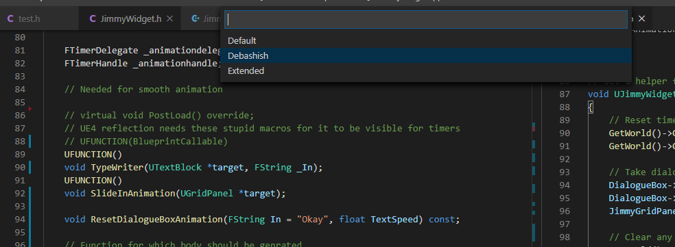

The buildspaces are a way for the community to share their function/generator definitions with other people.
For example, a buildspace by my name(`Debashish`) will contain data about functions I use a lot that are not engine functionality.
This would enable you to copy my workflow or extend for your own, for example.

Since not everybody would be an expert in their fields,
having a copy of a knowledgeable person's buildspace will allow us to write code without concern for errors.

### The definitions

---

Every entry in a `buildspace.templates` contains the following information

- **id**: The label that will be visible to the user.
- **classprefix**: When user inputs the name for his class, this(A/U/I) is automatically added everywhere.
- **headers**: The list of headers to add. These are added in the .h file for now. We are planning to support forward declaration in the _near_ future.
- **functions**: List of functions to add. The function definitions must be present in either **FunctionTemplates.json** (shipped by us) or
  **Functions_Ext.json** (extended by you)

### Example entry

---

```json
{
	"buildspace": "Debashish",
	"templates": [
		{
			"id": "Actor(Custom)",
			"classprefix": "A",
			"parent": "AActor",
			"interfaces": [],
			"Headers": [
				"CoreMinimal.h",
				"GameFramework/Actor.h",
				"TimerManager.h"
			],
			"Functions": [
				"BeginPlay",
				"Tick",
				"OnConstruction",
				"StartDesigner"
			]
		}
	]
}
```

The above snippet shows a manually added buildspace. Unlike the plain Actor defintion, **TimerManager is also included**.
**StartDesigner** is a function I use which redirect from OnConstruct when the designer clicks a button.

The full body for this function can be found in your extensions.json file. My builspace (or any buildspace you add)
is selectable at this point as shown below


