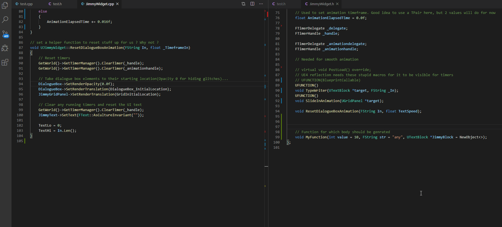
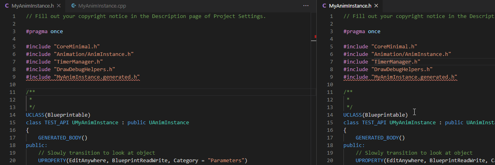
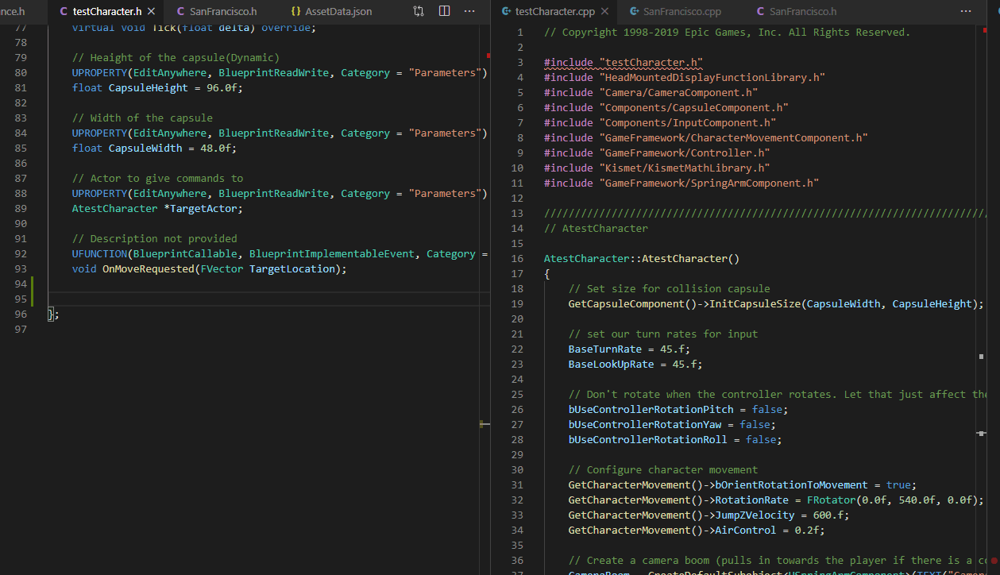

This module is the key highlight of the package.
Of course, you can call every individual commands using the command palette.
However, this feature lets you call almost all of them from key bindings right between your code.

This considers your **current file**, **current line text**,
**past few lines**, **the parent clas** and automatically performs an action

The best thing about it is, it does not depend on intellisense.
In video game development, we often follow a flow and design gameplay components in parts
We know what lines follows but we rewrite it every. single. time.

Below are some examples how the **entire command library** can be contextually activated from code.

Apart from them, all you need to keep in mind is that,
when you see the following pattern after using a snippet,
you can activate your context binding to follow up with generated code.

**Warning: A lot of flashing images ahead. Use this list if you are uncomfortable.**

- [link] Function body generation
- [link] Adding header packs

### List of Examples

---

- **Function body generation** : Works with all ue4 functions. [More...]

- **Adding header packs** : Select a pack of headers to include. User Extensible [More...]

- **Code follow-up** : When you see `// context`, you can follow up with optional useful code.

- **Initializing components** : _copies_ initialization code for variables right from header.
  Prevents silly mistakes and there are plans to provide completion for all unique components

They are all separate modules but you can access them right from the code. You get the general idea.
Of course, each function has their own special utility but this one's THE utility.

Now head to the [next page](/docs/trailblazer/context-keys/1) and setup key bindings for this.

If you already know how to do that, head to [activation context](/docs/sleeping-forest/context-keys/2) section to see under which context each function is called.

See you later... 🖐
