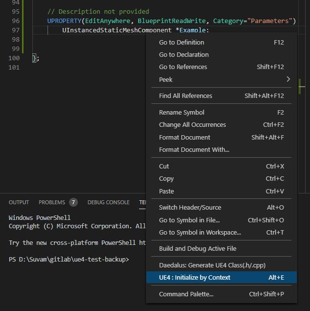
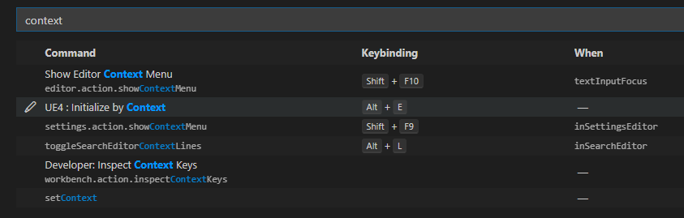

The commandlet under question is by default available as a menu extension under the name **UE4: Initialize by Context**.
You can get contextual completion through right-click menu as well, but we would preferably want a key-binding for that.

### Binding the keys

---

The settings for key-bindings can be obtained at **File** --> **Preferences** --> **Keyboard Shortcuts**

Find the command in the list and assign a key binding that does not conflict with any other important keybindings. (Or which ever you are comfortable with)

Thats it. You can now access almost the entire extension from this key binding. 
To learn the contexts in which specific commands get called, head to [activation context](/docs/trailblazer/context-keys/2).

See you later... 🖐
