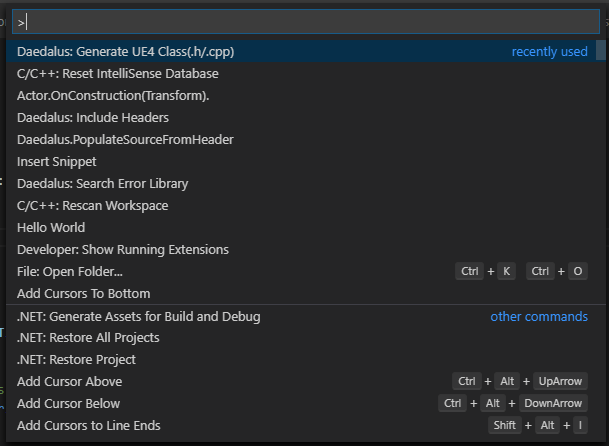

## Class generation module

This module is used to generate class bodies closely resembling how UE4 normally does it.
The data related to generated to generation is stored in JSON format and you can add your own definitions easily

- Requested headers are automatically injected.
- Requested functions are automatically injected.
- Plugins/Game folders are auto-detected.
- Comes pre-packed with most used classes.
- Fully customizable to add own classes.

#### Walkthrough

1. Call the commandlet `Daedalus: Generate UE4 class(.h/.cpp)`

2. Select the `buildspace`.This lets you select between the default build templates that UE4 uses or some custom ones that you define.
   For example, I tend to use my own specialized templated under a buildspace by my name. New buildspaces can be added as extensions.

3. Select the `module` in which to add the class. The main game module is always listed as **_"Game"_**
   Any plug-ins are listed alongside and you may select any. _(Modules named ThirdParty, Shaders etc. are ignored.)_

4. Select the parentclass to call. By default only generic classes are included(Beta engine packages are included in a separate buildspace).
   When v1.x ships, almost every class would be listed here and ready to be chosen.

5. Next, you will be prompted to add the classname. Since VSCode is basically a text editor, you will have to take care not to name it similar to a pre-existing engine class.

6. Next up, there will be a pop-up notifying you about changes you are about to make. This step exists to prevent accicents. Read the pop-up before committing changes.

7. Worry not, because if there are existing files by that name, more warning pop-ups will appear and you have to reaffirm your decisions.

8. After all that, you will have your classes generated as per provided templates (or your own template). In the future, after consulting with users, I plan to reduce the number of choices you have to make and depend more on a config file instead. Until v1.0.0, this procedure stands.

The next page covers how the module is implemented. The page after that covers how to add your own class definitions/functions.

#### FAQ

1. **Do I need to regenerate the project for my new classes to be indexed ?**
   No. When you start debug(F5), It's done automatically.
2. **_Do I have to close editor if I create a class ?_** No. Creating a class compiles fine.
   But you would need to exit to add parameters in header.
3. **Does hot reload work with this system ?** Of course not. What we are doing is creating entire new classes. Hot reload only works on changes to source files.
   That said, hot reload on VSCode is hit/miss. However, the 15 second max compile times combined with compiling shaders from command line is blazing fast. You won't be missing hot reload at all.
4. **How can I avoid creating duplicate classes ?** Try to have one pair(.cpp/.h) per class and name the class same as the file. With a little bit of foresight, no double classes will exist. Even if you accidentally make one, the build system wont compile and let you know.
5. **I am getting build errors ?** Surely can't be the fault of this extension. Regardless, may I present to you the ability to search for errors right from your VSCode !!!

See you later... 🖐
