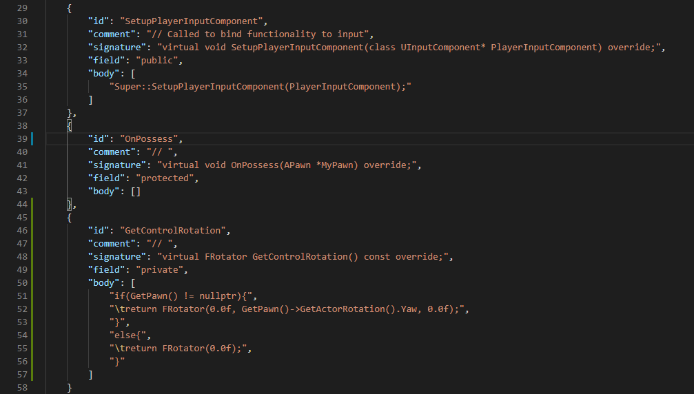

The following list of templates are shipped with the extension.
All of the following classes are from the engine and follow the ue4 syntax closely,
albeit with a few modifications here and there.

#### File structure(1/3)

The module pulls its data from six JSON files

- `Default_Actor_h.json` and `Default_Actor_h.json` are the first to be written to respective header/source file to give skeleton for everything else.
- The $1, $2 symbols are later replaced automatically.

```json
[
	"// Fill out your copyright notice in the Description page of Project Settings.\n",
	"#include \"$1.generated.h\"\n",
	"UCLASS()",
	"class $2_API $4$1 : public $3",
	"{",
	"\tGENERATED_BODY()\n",
	"public:",
	"\t$4$1();\n",
	"protected:",
	"private:",
	"};"
]
```

```json
[
	"// Fill out your copyright notice in the Description page of Project Settings.\n",
	"#include \"$1.h\""
]
```

---

#### File structure(2/3)

- `BuildTemplates.json` and `BuildExtension.json` are then used to provide class selection options and contain relevant data regarding what to add into the skeleton produced by previous part.
- Every entry of this json file has the following structure _(refer the image)_


Explanation:

- As mentioned previously, every buildspace has a list of templates referred by **_id_**.
- The **_classprefix_** is appended at required places.
- Our target class derives from whatever exists in **_parent_** field.
- **_Interfaces_** support will be added in future updates.
- **_Headers_** listed here are appended automatically to (.h) files
- **_Functions_** are listed here. These are pulled from the other 2 JSON files as mentioned in the following section.

---

#### File structure(3/3)

- `FunctionTemplates.json` and `FunctionExtension.json` are used to lookup for listed **_Functions_** by ID.



Explanation:

- The **_id_** in both JSON files must match.
- **_Comment_** is added on top of header definitions.
- **_Body_** is appended to source(.cpp) file.
- **_Field_** is used for position in header file.
  When calling other commandlets as well, It is always recommended to not delete public/protected/private to avoid any bugs.

As you saw, there are two files data is pulled from. One is for use by the developer, the other is for use by the users to extend.

The extension feature is not battle-tested. Until the plug-in reaches v1.0, I will account for user feedback to patch any issues.
But that's that.
A perfect module when you just need to write tons of skeleton code and nothing else.

Happy coding.

See you later... 🖐
