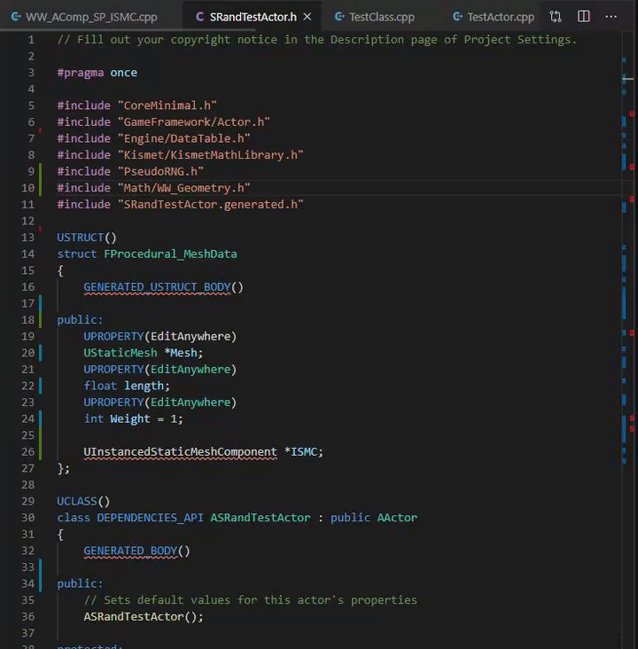

## Header manager module

The header manager is there to help in quickly resolving include dependencies.

- Run `Daedalus: Include Headers` commandlet and select a package to include headers.
- No duplicates are produced. Feel free to spam.
- Many of my commandlets use this module internally. So, there won't be duplicates.
- This means dependencies are easier to resolve with commandlets primarily.

**_This commandlet throws warning unless run from a valid header(.h) file_**

In reality, this being a niche project, you can't find literally every subset of headers you might use.
If you want to modify packages, you can join the community and suggest improvements and features.

**_Full Disclaimer_**: When you quickly add multiple headers, the intellisense might die for a few seconds.
Give it 10-15 seconds. It parses the new headers you included.

Find the list of definitions in the next page.

See you later... 🖐
