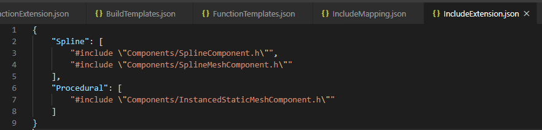

#### Module structure

This module simply has two json files it gets its data from (**_IncludeTemplates.json_** and **_IncludeExtension.json_**)

- The **_id_** is by what name it will appear in the selection list.
- The list of headers is what will get added.

Extend the second json file and you are done. Next time, your options should appear.
Try to avoid modifying the IncludeExtension.json. It contains the most essential defaults.

See you later... 🖐
