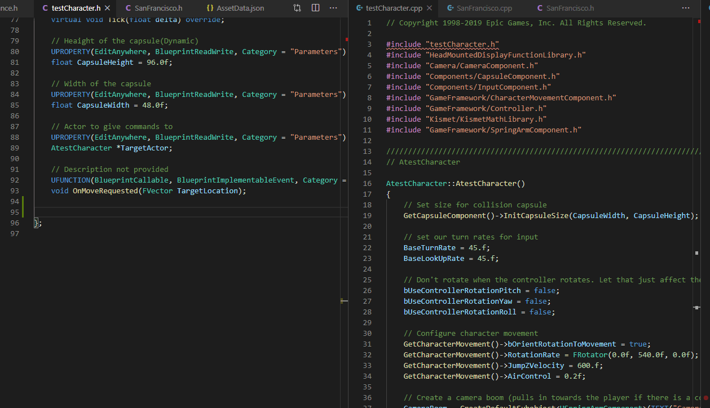

Utilities for drawing lines, spheres, arrows etc. Supports

- line traces (Single/Multi)
- sphere traces

Full list can be [found here](/docs/sleeping-forest/udebug-snippets-full-list)

### Context bindings

---

You get the option to **context fill results** of a linetrace/shapetrace. If a context specific auto-completion is performed, you get

- Debug points at hit location
- A output mentioning name of actor and location of hit
- A line trace from your actor to the hit location.

The above image shows the results.

### FPS management

---

Multiple versions of same snippet is available with pre-calculated FPS values. If you are not sure, why you need that,
You would get that to get results like folowing,
if you use the snippet from tick with your taregt FPS.
