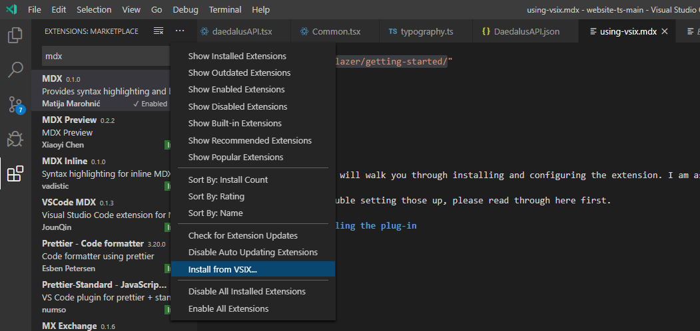
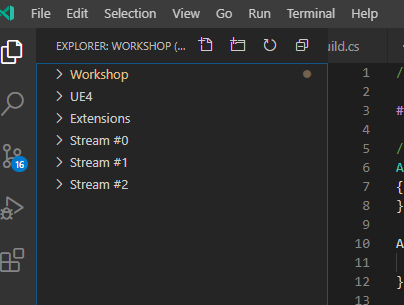

This module will guide you through installing and configuring the extension.
You should have a working copy of [VSCode](https://code.visualstudio.com/download)
or [VSCode Insiders](https://code.visualstudio.com/insiders/).

If you had any trouble setting those up, please read through here first.

### Step 1: Installation

#### From store

The extension is now distributed via the extension store. You can search for `Sleeping Forest` and get it.
It will be updated regularly, so **read changelogs for updates**.
In it, there will be API changes, links to updated documentations and feature showcases.

#### From VSIX file

You can install nightly builds from from [CI outputs](https://gitlab.com/suvam0451/sleeping-forest-ue4/pipelines/) as well.

The option to manually install an extension can be found from the extensions tab as shown below

After selecting the `.vsix` file, you might be asked to restart your editor.
Do so, and then you can find the extension listed along any other extensions
which can be accessed from the sidebar as shown below.

### Step 2: Basic Configuration (Programming)

Fire up the project using the `.code-workspace` file.
_(always use it to start the project)_.

Run `UE4 : Inject Workspace definitions in Workspace file` from the command palette. _(Ctrl + Shift + P in windows)_

This will make some changes to your `.code-workspace` file.
For starters, it will significantly improve your **intellisense parsing**
and fetch **better search results**.

The new workspace file should look like this.

Your new sidebar should look like the following (minus the stream folders.)

Restart the editor.

NOTE : **Everytime you regenerate project files**, run this command to get
configs, mod-kit and streams/modules(if any).
Then restart the editor for all configs to be applied _(Shortcut --> (Ctrl +R))_.

Next up, get started with the following key features of the extension

1. Setting up contextual auto-completion... [link](/docs/sleeping-forest/context-keys/)
2. Explore the snippet library... [link](/docs/sleeping-forest/snippets-overview)
3. Command line tools for faster development... [link]()
4. Individual callable functions and features... [link]()

### Step 3: Basic Configuration (Asset Management)

Coding is not required for using the asset management tools. The concept of **asset stream** targets
a structured folder with your raw files {.fbx, .wav, art} and applies a lot of optimization on them
{image compression, duplicate detection}.

It then **generates JSON data** for each _asset type_ and _each folder_. This is useful for
data driven gameplay, optimizing build sizes and faster development.

Your **assets can be automatically imported** and instead of plugging assets manually,
you can use the JSON files to fill the engine DataTables.

This is meant to extend to procedural level design systems and dialogue systems etc.,
where classes in your engine would ask for data tables instead of asset references.

Following links will guide you through setting up and configuring your first **Asset Stream**.

1. [Tutorial](/docs/sleeping-forest/hello-asset-streams)
2. [Importing basic assets](/docs/sleeping-forest/importing-asset-streams)
3. [Configuring your import](/docs/sleeping-forest/importing-asset-streams)
4. [Packing textures before importing](/docs/sleeping-forest/asset-stream-texture-sets)

### Step 4: Customizing modules

Most modules of this extension can accept additional definitions from one more
JSON file accessible through your sidebar.
They are meant to act as drop-in extension for headers/classes I might have missed.

This means, you can write add own rules on top of what the developer or the community puts up.

1. Extending the headerpacks... [link](/docs/sleeping-forest/extending-header-packs)
2. Adding your custom class generator... [link](/docs/sleeping-forest/extending-the-buildspace)
3. You can share back your mods for the community through our Discord.

### Step 5: Technical details

The following devlogs cover how I am going about making this plug-in.
I am also sharing a few open-source tools that are made to be usable cross-engine.
All of them are being used as part of this extension.

1. High level npm package for applying smart edits in c based languages
2. Asset pipeline tool written in go.

My motivation for writing this extension was I find automating tedious tasks exciting.
I want to make games with system driven gameplay and true player agency with active consequences.
However, the sheer amount of learning, motivation and expertise required always kept it out of reach.

Developing games should be a fun learning process and I will use whatever programming expertise
I have garnered in the past couple of years to bring you
powerful tools that let you focus on making awesome games.

You can go through the complete list of features listed [here](/docs/sleeping-forest/features)

See you later... 🖐
