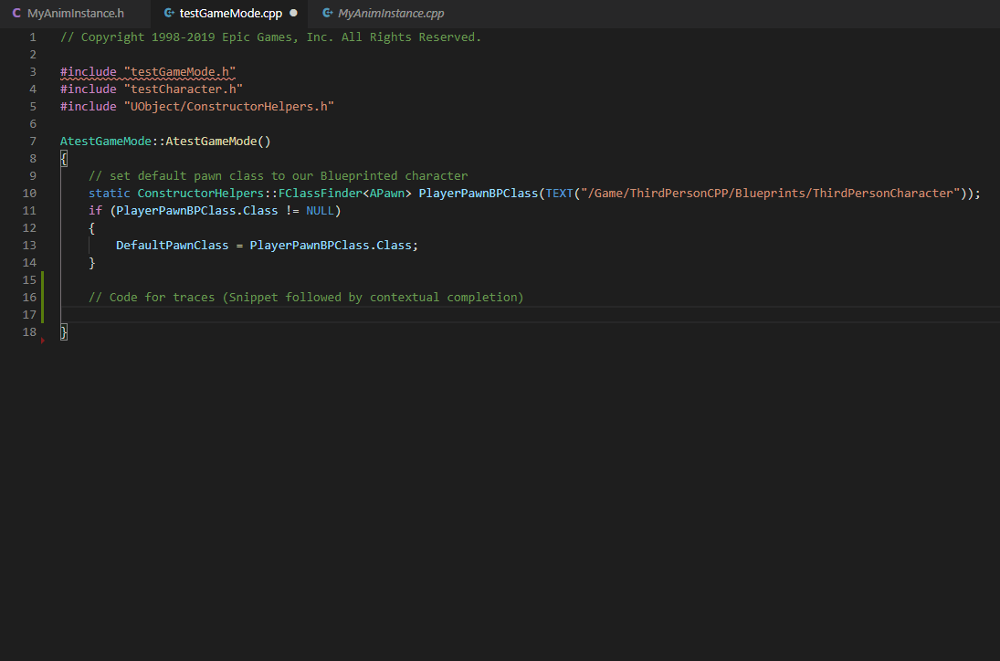

The following features are available for this extension.

#### Snippets

---

Snippet files which cover most of your basic programming auto-completion needs with Unreal Engine 4.
The following self-indicative namespaces are available.

1.  **uprop** : Adding properties in header
2.  **uinit** : initializing components/props
3.  **udebug** : Drawing spheres, lines with improvements.
4.  **ugs** : ObjectFinder, ClassFinder, AssetRegistry etc.
5.  **utrace** : Multi/Single Trace/Sweep
6.  **custom** : NewObject, CreateDefaultSubobject, UE_LOG() anyone ?
7.  **Add your own** : Give me snippets and I'll add them. That way everybody wins.

Note: The `context key` can be used after generating code by some of these snippets. This allows you to do stuff like following :

#### Contextual auto-completion

---

Contextual completion module is a powerful tool which uses **all other code modules** to
provide you customized auto-completion, on the fly. To name a few, you can

- Generate initialization code for components.
- Generate function bodies from header.
- Add a set of headers
- Dynamically generate snippets of tedious-to-write code.

All with a **single key-binding** !!!

Learn more [here...](/docs/sleeping-forest/context-keys/)

#### AssetStreams

---

A framework to have the same file structure across multiple projects.
It lets you create special folders with an "Assets" folder in them.
The folder can be **read on demand** and data about all the assets is extracted to a json file.
It also creates a **python import script**.

This script can be called in UE4 to get your assets from multiple folders with multiple configs.
The following tutorials and references will get you started.

1. Creating asset AssetStreams
2. Maintaining folder references in VSCode
3. Requesting updates after new batch of assets are added
4. Importing assets to UE4
5. Uses vanilla Python API. Always imports in silent mode.
6. Implementation details (Extra)

**Use Case** : If you store your assets in cloud drives and start a new projects from scratch every few week,
this tool will make sure your imports are in order and preserve integrity of your source files.
[Learn More...](/docs/sleeping-forest/hello-asset-streams)

#### Commandlets

---

A bunch of commands for various tasks. You can access command palette using `Ctrl + Shift + P` in Windows.
However, for efficiency, you would want to make exclusive use of the `right click context menu` and bind the commands you use most.

This subsection of commandlets allow you to add functions, manage headers etc. while in VSCode. This means it is all about text editor manipulations.

---

##### CMD Utilities

---

These commandlets allow you to **_run engine tasks_** via command line. For example :

1. Compiling shaders
2. Compiling code
3. Compiling game (No custom config yet) _[Planned]_

NOTE : **For now, only windows support** is available. I will appreciate anyone testing this on other client OSes.

#### Improved Intellisense

---

`Command Palette` --> `UE4 : Inject Exclude definitions in workspace file`

This commandlets **writes to your .code-workspace** config file. You have a level of control over what gets changed.
This is very important for better search results and significantly improved intellisense. [Learn more...](/docs/sleeping-forest/workspace-configurations)

**Use Case** : Intellisense in VSCode is worse than VS, but it's not useless. Although, I won't guarantee VS level optimization, this improves the developer experience a lot.

#### Texture packing

---
