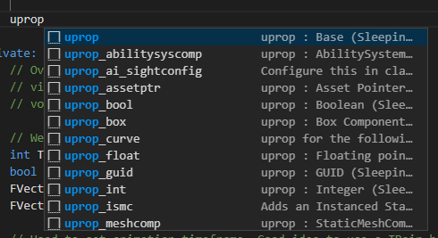
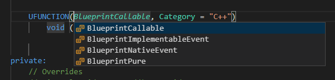
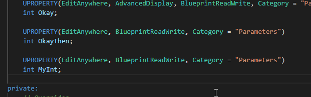
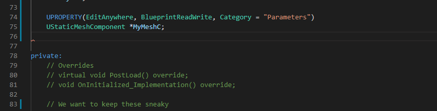

import {
	Footer,
	Alert,
} from "../../../../src/components/Decorations";

<Alert
	head="Warning about ninjas !!!"
	body="It might not work out the way you wnat it to but don't worry..."/>

Snippets are the bread and butter of any editor extension. The snippets shipped with this extension all start with `u` _(to avoid conflicts)_.
This is except a few macros like loops and switch statements which go along with any extension.

**NOTE:** The only linters available in VSCode are `Clang-format` and `C++ tools`. And they will revert the tabs _(Like the tabs under UPROPERTY())_.
You might want to disable them, or even better, go along it.

Snippets are listed into the following categories with their own namespaces and can be called by `unamespace_xyz`.

### Snippet namespaces

| Starts With       | Links                                                                                                               | Function                                    |
| ----------------- | ------------------------------------------------------------------------------------------------------------------- | ------------------------------------------- |
| **uprop**         | [Overview](/docs/sleeping-forest/snippets-overview/uprop), [Full List](/docs/sleeping-forest/snippet-lists/uprop)   | Adding UPROPERTY()                          |
| **ugs**           | [Overview](/docs/sleeping-forest/snippets-overview/ugs), [Full List](/docs/sleeping-forest/snippet-lists/ugs)       | Gameplay/Asset calls like AssetFinder       |
| **uinit**         | [Overview](/docs/sleeping-forest/snippets-overview/uinit), [Full List](/docs/sleeping-forest/snippet-lists/uinit)   | Initializing components/variables and more  |
| **utrace**        | [Overview](/docs/sleeping-forest/snippets-overview/utrace), [Full List](/docs/sleeping-forest/snippet-lists/utrace) | Line/Shape traces                           |
| **udebug**        | [Overview](/docs/sleeping-forest/snippets-overview/udebug), [Full List](/docs/sleeping-forest/snippet-lists/udebug) | Debug lines/spheres                         |
| **udel**          | Not large enough                                                                                                    | Delegate binding                            |
| **ulog**          | [Overview](/docs/sleeping-forest/snippets-overview/ulog), [Full List](/docs/sleeping-forest/snippet-lists/ulog)     | Logging to console                          |
| **udata**         | [Overview](/docs/sleeping-forest/snippets-overview/udata) , [Full List](/docs/sleeping-forest/snippet-lists/udata)  | DataTables and such                         |
| **ugas**          | N/A                                                                                                                 | Gameplay Ability Systems **WIP**            |
| **umat**          | Listed below                                                                                                        | Material handling through code              |
| **umatnode**      | N/A                                                                                                                 | Creation of advanced material nodes **WIP** |
| **ue4_suvam0451** | [Overview](/docs/sleeping-forest/snippets-overview/misc), [Full List](/docs/sleeping-forest/snippet-lists/misc)     | Extra stuff like loops, switches            |

### How to use

---

While scripting, you will start to see snippets very often like this _(squares)_.
If not, you should give the namespaces a quick look to have an idea of what keywords are expected.

There are stops along the snippets you have to tab through. Fill a value, tab, fill next value.

However, some snippets will provide you options to select like the following.
You have to select the option and then **tab to continue** to next stop

For example, in `ufunc` macro, you first select the function type and the select the return type and then the name.
You can leave at any time by clicking elsewhere.

### Contextual modification

---

Many of the snippets will be internally bound to the `context key`. You should have a lookout for situations like these.
These are some examples, you will find a better overview at [context keys...](/docs/sleeping-forest/context-keys/2)

**1. UPROPERTY specifiers can be cycled through**. This is one-way behaviour. You have to Ctrl +Z to return back. Press it 3+ times for no specifiers.

**2. Copy code for Component declarations**. Every component needs to be initialized,
registered and attached to a SceneComponent to be visible. Context keys make it simple for any _componenent_.

As you can see, the name used matches the name you gave and everything else if auto-determined.
Anyways, you get the idea. **Full list is covered in the context key segment.**

Now go explore the namespaces and remember to call them in code. I update the list every now and then so always check the changelogs for wiki updates !!!

See you later... 🖐
