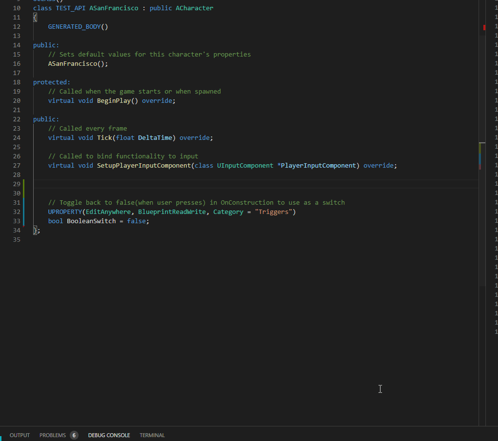

import {
	Footer,
	Alert,
} from "../../../../src/components/Decorations";

Snippets in this namespace are used to **reduce macro usage in header** for UPROPERTY() declarations.

<Alert
	head="Heads up about scope warnings"
	body="BlueprintReadWrite may only be assigned to props in public field."
/>

Complete list of codes can be found [here](/docs/sleeping-forest/snippet-lists/uprop).

### Samples

---

**Basic props**

```cpp
// ${2:Description not provided} --> uprop_mesh
UPROPERTY(EditAnywhere, BlueprintReadWrite, Category="Parameters")
	UStaticMesh *$1;
```

**Components:**

```cpp
// Description not provided --> uprop_sphere
UPROPERTY(EditAnywhere, BlueprintReadWrite, Category="Parameters")
	USphereComponent* $1;
```

**Maps/Arrays:**

```cpp
// ${2:Description not provided} --> uprop_ismc_map
UPROPERTY(EditAnywhere, BlueprintReadWrite, Category="Parameters")
	TMap<int, UInstancedStaticMeshComponent*> $1;
```

**Boolean switches** : A boolean parameter defaulting to false, intended to be used like a button by designer.
See XYZ for implementation of the trick.

```cpp
// ${2:Toggle back to false(when user presses) in OnConstruction to use as a trigger} --> uprop_switch
UPROPERTY(EditAnywhere, BlueprintReadWrite, Category="Triggers")
	bool $1 = false; // context
```

### Contextual activation

---

The list of context key rules for this namespace are as follows:

1. Component declaration lines **copy their constructor**

```cpp{3}
// Description not provided --> uprop_sphere
UPROPERTY(EditAnywhere, BlueprintReadWrite, Category="Parameters")
	USphereComponent* $1;

// --- generates ---
	$1 = CreateDefaultSubobject<USphereComponent>("$1");
	$1->AttachToComponent(RootComponent, FAttachmentTransformRules::KeepRelativeTransform);
```

2. **boolean switches copy the code.**

```cpp{3}
// Toggle back to false(when user presses) in OnConstruction to use as a switch
UPROPERTY(EditAnywhere, BlueprintReadWrite, Category="Triggers")
	bool ExampleSwitch = false; // context

// --- generates ---

// Function(called on demand) will be bypassed while packaging
if (ExampleSwitch == true) {
	// Insert a function here;
	ExampleSwitch = false;
}
```

See you later... 🖐

#### Bonus Intellisense Advice

---

The 3-4 seconds delay after adding snippets is to parse new variables.
You can force intellisense by `Ctrl + Space` for speed.


