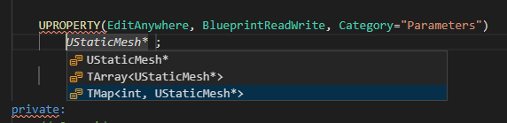
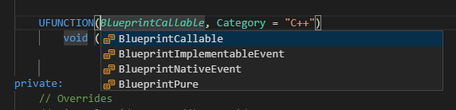

import {
	Footer,
	Alert,
} from "../../../../src/components/Decorations";

Snippets in this namespace are used to **reduce macro usage in header** for UPROPERTY() declarations.
Variations are available for maps and arrays as well.

They also have **ufunc** for other data structures.

There degree of freedom exposed to designer in editor can be switched like this using the `context key` like this.


Complete list of snippet codes can be found [here](/docs/sleeping-forest/snippet-lists/uprop).

The context keys will cycle through the following sets of macros in a cycle...

| Classifier       | Macros                                               | Editor behavior                                 |
| ---------------- | ---------------------------------------------------- | ----------------------------------------------- |
| **base**         | VisibleAnywhere, BlueprintReadWrite ,EditAnywhere    | Visible and Editable                            |
| **readonly**     | BlueprintReadWrite, VisibleAnywhere                  | Readonly in editor. Blueprints can still access |
| **advanced tab** | VisibleAnywhere, AdvancedDisplay, BlueprintReadWrite | Readonly in dropdown                            |
| **blank**        | none                                                 | Pure C++ with basic engine exposure             |

You can even remove all macros unless you are heap allocating.

<Alert
	head="Heads up about scope warnings"
	body="BlueprintReadWrite may only be assigned to props in public field."
/>

### Dropdowns

---

Every uprop_xyz snippet will first ask you for singleton/array/map since v0.6.12. *(uprop*xyz_adv and uprop_xyz_arr were removed in favor of these)\*.



ufunc will ask for blueprint behavior and provide you with most used return types




### Contextual activation

---

The list of context key rules for this namespace are as follows:

**1. Component declarations copy their constructor**

```cpp{3}
// Description not provided --> uprop_sphere
UPROPERTY(EditAnywhere, BlueprintReadWrite, Category="Parameters")
	USphereComponent* $1;

// --- generates ---
	$1 = CreateDefaultSubobject<USphereComponent>("$1");
	$1->AttachToComponent(RootComponent, FAttachmentTransformRules::KeepRelativeTransform);
```

**2. boolean switches copy the code.**

```cpp{3}
// Toggle back to false(when user presses) in OnConstruction to use as a switch
UPROPERTY(EditAnywhere, BlueprintReadWrite, Category="Triggers")
	bool ExampleSwitch = false; // context

// --- generates ---

// Function(called on demand) will be bypassed while packaging
if (ExampleSwitch == true) {
	// Insert a function here;
	ExampleSwitch = false;
}
```

**3. Body can be generated and auto-added to .cpp for ANY function.**

```cpp{2}
UFUNCTION()
void TypeWriter(UTextBlock *target, FString _In);

// --- generates ---
void UJimmyWidget::TypeWriter(UTextBlock *target, FString _In) {
	// Function not implemented
}
```

Thats most of it. Keep an eye on updates in changelog.

See you later... 🖐

### Few Samples

---

**Basic props**

```cpp
// ${2:Description not provided} --> uprop_mesh
UPROPERTY(EditAnywhere, BlueprintReadWrite, Category="Parameters")
	UStaticMesh *$1;
```

**Components:**

```cpp
// Description not provided --> uprop_sphere
UPROPERTY(EditAnywhere, BlueprintReadWrite, Category="Parameters")
	USphereComponent* $1;
```

**Maps/Arrays:**

```cpp
// ${2:Description not provided} --> uprop_ismc_map
UPROPERTY(EditAnywhere, BlueprintReadWrite, Category="Parameters")
	TMap<int, UInstancedStaticMeshComponent*> $1;
```

**Boolean switches** : A boolean parameter defaulting to false, intended to be used like a button by designer.
See XYZ for implementation of the trick.

```cpp
// ${2:Toggle back to false(when user presses) in OnConstruction to use as a trigger} --> uprop_switch
UPROPERTY(EditAnywhere, BlueprintReadWrite, Category="Triggers")
	bool $1 = false; // context
```
