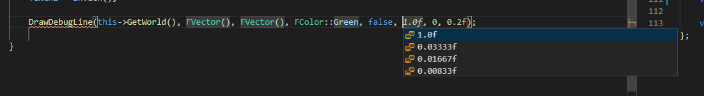

Snippets in this namespace are used to draw lines, spheres, arrows etc.
There is a FPS support feature that lets you get smooth debug shapes based on your target FPS.

That feature has been integrated into single macros like uprop.

Full list can be [found here](/docs/sleeping-forest/snippet-lists/udebug)

### Dropdowns

---

While calling snippets for runtime rendered shapes, you'll be asked for FPS.
The following values are pre-calculated for **N/A,30,60,120 FPS**

Similarily, FPS is pre-considered for most other snippets in this namespace.

### Context bindings

---

No contextual bindings exist for this namespace. However, some of these get called from other namespaces like you would see for the utrace namespace.

This means, you would need to add respective headers when needed. Or you can use pack named `Debug` from the header manager.

Thats most of it. Keep an eye on updates in changelog.

See you later... 🖐
