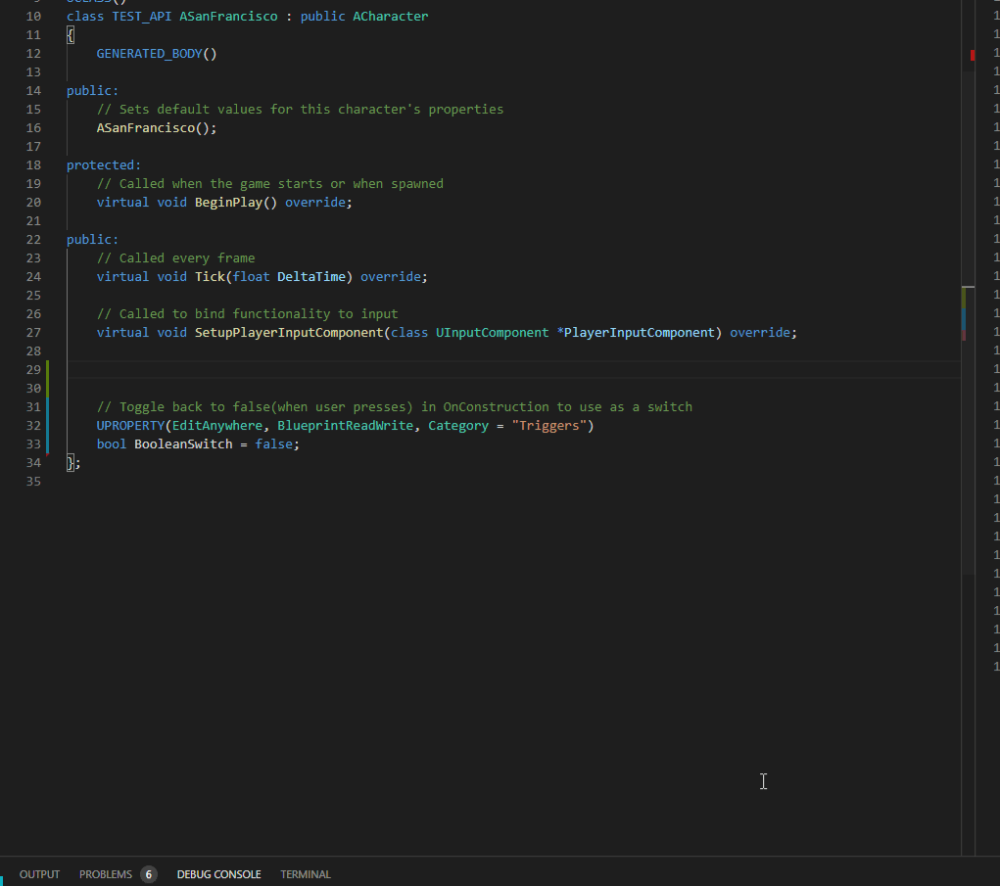

import {
	Footer,
	Alert,
} from "../../../../src/components/Decorations";

Snippets in this namespace are used to reduce macro usage for UPROPERTY() declarations.
There are three subclasses allowing the designer varying degrees of freedom at the editor.

### base uprop snippets

---

The base line of macros are called using `uprop_xyz`.
They carry the { **VisibleAnywhere**, **BlueprintReadWrite** } macros.
Below example shows two such snippets being inserted. Notice the 3-4 seconds delay while intellisense parses the new variable.



I have a throttled i7 8th gen laptop and had 80 mozilla tabs open with screen recording ON.
You would obviously fare better.
[Complete List](/docs/sleeping-forest/uprop-snippets/1)

### uprop_adv snippets

---

The `uprop_adv_xyz` line of macros replace **EditAnywhere** with **VisibleAnywhere**,
making them hidden from designer view without dropdown.

### uprop_ro snippets

---

The `uprop_ro_xyz` line of snippets have { **VisibleAnywhere**, **AdvancedDisplay**, **BlueprintReadWrite**}
macros. This makes them accessible through a dropdown in editor. It also prevents edit through left editor panel.
Hoever, modification in blueprints is still allowed

### uprop array/map snippets

---

In some cases, a map of components is required to dynamically add/remove them at runtime/designtime.
For this, the `uprop_xyz_map` or `uprop_xyz_arr` is used.

---

# Clean this

<Alert
	head="Invocation Tradeoff"
	body="If you choose to use Commandlets, missing headers are automatically injected. Snippets are more accessible."
/>

**_The cursor position at end (\$0) automatically positions you to fire up your next snippet/commandlet._**

<Alert
	head="Quick reminder about scope warnings"
	body="BlueprintReadWrite may only be assigned to public field variables. This means these snippets should be called in public field."
/>

---

#### Fundamental Set

Simple templates, in case your required class is not covered by the plug-in.

##### uprop

This lets you dictate the type and name of the function.

- **_\$1_**: mention type and name of property.
- **_\$2_**: Helpful comment

```cpp
// ${2:Description not provided}
UPROPERTY(EditAnywhere, BlueprintReadWrite, Category = "Parameters")
	$1;
```

##### uprop_ro

Same as uprop but not editable by user in inspector.

```cpp
// ${2:Description not provided}
UPROPERTY(VisibleAnywhere, BlueprintReadWrite, Category="Parameters")
	$1;
```

---

#### Specific Declarations

Snippets/Commandlets for individual classes.

##### uprop_mesh

```cpp
// ${2:Description not provided}
UPROPERTY(EditAnywhere, BlueprintReadWrite, Category="Parameters")
	UStaticMesh *$1;
```

##### uprop_switch

A boolean parameter defaulting to false, intended to be used like a button by designer.
See XYZ for implementation of the trick. Category is changed to _Triggers_.

- **\$1**: mention name of property.
- **\$2**: Your comment

```cpp
// ${2:Toggle back to false(when user presses) in OnConstruction to use as a trigger}
UPROPERTY(EditAnywhere, BlueprintReadWrite, Category="Triggers")
	bool $1 = false;
```

**_uprop_switch_** is followed up by **_uinit_switch_** in the source file as follows.

```cpp
// This function may be private
void ARandomizedWallActor::OnConstruction(const FTransform &Transform)
{
	// ${2:CallbackFunction is a public function}
	($1 == true) ? {$2:CallbackFunction()} : ($1 = false);

	// For example, (Switch == true) ? CallbackFunction() : (Switch = false);
	// CallbackFunction can update your actor/component on demand.
}
```

##### uprop_ismc

Adds a property of type UInstancedStaticMeshComponent.
Explore more about this useful class [here](/tutorials/ue4/instanced-static-meshes/1)

- **\$1**: mention name of property.
- **\$2**: Your comment

```cpp
	// ${2:Description not provided}
	UPROPERTY(EditAnywhere, BlueprintReadWrite, Category="Parameters")
		UInstancedStaticMeshComponent *$1;
```

##### uprop_mesh

Adds a StaticMesh property. You may want to use Asset References instead. Read more about asynchronous asset loading [here(coming soon)]().

```cpp
    // ${2:Description not provided}
    UPROPERTY(EditAnywhere, BlueprintReadWrite, Category="Parameters")
    	TMap<int, UStaticMesh*> $1;
```

**_Use-cases_**: You can see SM map usage here. You will also see potential issues that might come up.

---

#### Rich declarations

Helps in declaration of maps, arrays, most of which are difficult to type straight.

##### uprop_ismc_map

Used in procedural workflows to map meshes to components dynamically. Implementation can be seen [here]()

```cpp
    // Description not provided
    UPROPERTY(EditAnywhere, BlueprintReadWrite, Category="Parameters")
    	TMap<int, UInstancedStaticMeshComponent*> ;
```

##### uprop_mesh_map

Adds a map of StaticMesh. You may want to use Asset References instead. Read more about asynchronous asset loading [here(coming soon)]().

```cpp
    // ${2:Description not provided}
    UPROPERTY(EditAnywhere, BlueprintReadWrite, Category="Parameters")
    	TMap<int, UStaticMesh*> $1;
```
