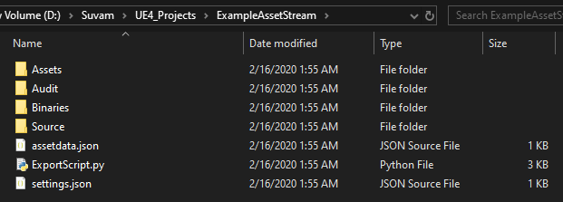

In this tutorial we will setup our first asset stream and link it to Unreal Engine through python API.

As mentioned before, we run `UE4: Create New Asset stream` and select teh folder. See below image for the folder structure and what each file means.

### The file structure

---

#### Assets

This is where you would put your **meshes**, **audio files** and **textures**
(Not sets of texture, we have a special tool for handling those)

Lets say, I have put 2 meshes and 1 exmple wav file into the Asset folder

#### Audit

This is where your JSON data for the **entire asset folder** is stored.
You also have per-folder audit data.
But if you want a review list, here is where you'll find them.

#### Binaries

The golang tools get copied over to this location. You don't have to worry about these.

#### Source

Let this folder be empty for now. We will add our mixamo animations, out TextureSets to this folder later.

#### assetdata.json

This is auto-generated when you call `UE4 : Refresh Asset Stream`. This contains data to be used by the python import script.

#### ExportScript.py

This file has the skeleton code for importing different types of assets.
This is a pretty long file and you don't want to modify it.

#### settings.json

This is your per-folder setting file. More settings will be discussed later.

To summarize, we have 2 meshes and 1 .wav file file in Assets folders. Everything else was auto generated.
Next up, [importing the assets](/docs/sleeping-forest/hello-asset-streams/1).

See you later... 🖐
