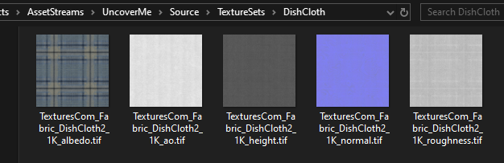
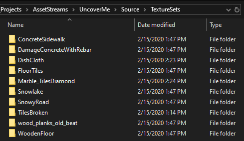
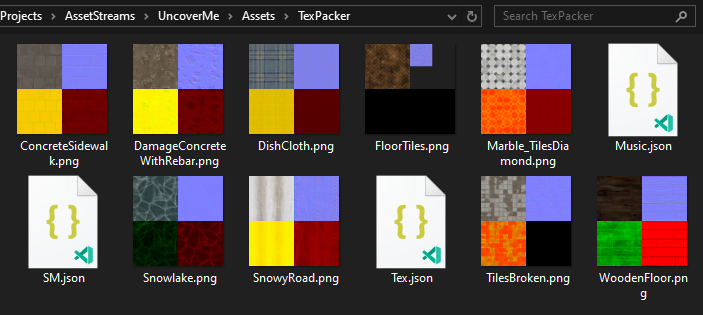

This is the first time you ae required to put your assets in Source folder instead.
By a TextureSet, I mean various textures used in PBR/Non-PBR flows.

For example, the folder below can be considered a textureset.

- Any other files than {.jpg, .png, .tiff} files are ignored.



**The minimum requirements for a textureset folder is an albedo/color texture and a normal map.**

If one of these if not found, the folder will be skipped and a warning will be logged.

Next up I have multiple folders set up like this in the **Source/TextureSets** folder.
Note that, you can only put textureset folders in this directory only.
Also, recollect that settings are applied per asset stream. For example,
if you have two projects with different asset optimization requirements, you would make two asset streams.

Anyways, this is my collection from textures.com. **Size 155.5 MB**



Each folder contains the set of texture, with at least an albedo and a normal map.
Next up, we want to set the flag for the micro-service to be true.

Again, from the settings file,

```json
"run_texturepacker": true
```

This setting exists because working with images is slow, especially if you have higher res textures.
You should run this occasionally to update textures, thats it.

Next time when you run the command `UE4 : Refresh Asset Folders`, something like this will appear and start processing your files(**windows only supported for now**)

You will get your assets inside the **Asset/TexPacker** folder. Remember how I said that anything that will be updated to the engine are in Asset folder.
This means your Source assets are not imported, but these mega texture will. By the way, **missing textures are colored black**.
There are plans to provided per texture-type default values but black it is for the time being.



If you know about [RMA textures](https://polycount.com/discussion/153215/rma-texture), you should get an idea of why it looks so colorful and funny. I will provide the nodes and materials to resolve it to their components soon.
For now, remember that **resizing is not supported**.

In next module we will be look at how to batch import mixamo assets. Mixamo animations are a godsend to small teams and
I think you should learn the workflow irrespective of if you want to develop a 3d game or not.

I will guide you from start to finish about setting up assets in UE4. You can later use the tools anywhere. [Coming Soon]

See you later... 🖐
