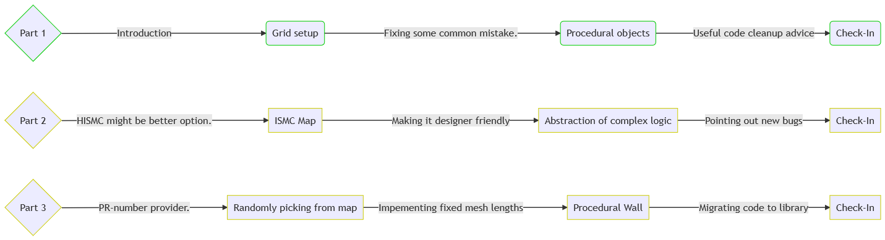

import {
	Footer,
	Alert,
	GifOverlay,
} from "../../../../src/components/Decorations";

#### Introduction

Instanced static meshes can be used in place of normal static meshes to save drawcalls significantly. Most importantly, please note the following:

- `ISMC` is Instanced Static Mesh component. It is a component to which a mesh can be allocated.
  Now, this mesh can be duplicated with carying transforms(rotations and locations) with no extra rendering cost.
- `ISM` will stand for Instanced Static Mesh. It is a single instance produced by the component.

🧾**_Wikipedia_**: In real-time computer graphics, **_geometry instancing_** is the practice of rendering multiple copies of the same mesh in a scene at once. For our purposes:

- We can have as many mesh instances as we want.
- Every mesh instanced by an ISMC would have same material.
- The ISM can not have negative scale. _It will hit a breakpoint._

Also, we can circumvent a few of these drawbacks:

- Lack of multiple materials can be covered by shader animations and switch nodes in the material itself.
- We can use separate meshes(with their respective materials). We would have to spawn instances for each ISMC in code.
  This is covered in part 2, allowing us to mix and match multiple instance components to construct our actor.

Before we start, there is also **_Hierarchial Instance Static Mesh Component_**(used by foliage actors).
They have additionally distance-culling built-in and they only slightly more expensive than ISMC.
Rest is pretty much the same. I might have a dedicated series for that on a later date.

This picture sums up my suggestion of when to consider using instanced meshes over other options.
Regardless, it is always good to know extra stuff.

---

#### Content

In this series, I will cover the following, indices marked with red will be added later.
I might later add specific content if there are many requests.

Download the files using the sidebar on left(top on mobiles) and refer the repository for code reference.

The download is source code, with only required assets.
There should be a class for each part of this tutorial.

---
