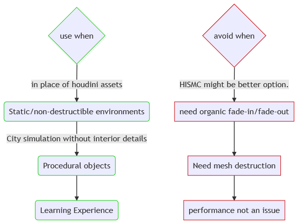

import {
	Footer,
	Alert,
	GifOverlay,
} from "../../../../src/components/Decorations";

#### Introduction

Instanced static meshes can be used in place of normal static meshes to save drawcalls significantly. Most importantly, please note the following:

- `ISMC` is Instanced Static Mesh component. It is a component to which a mesh can be allocated.
  Now, this mesh can be duplicated with carying transforms(rotations and locations) with no extra rendering cost.
- `ISM` will stand for Instanced Static Mesh. It is a single instance produced by the component.

Wikipedia : In real-time computer graphics, **_geometry instancing_** is the practice of rendering multiple copies of the same mesh in a scene at once. For our purposes:

- We can have as many mesh instances as we want.
- Every mesh instanced by an ISMC must have same material.
- The ISM can't have -ve scale. _It will hit a breakpoint._

So, how do we circumvent around these drawbacks ?

- Lack of multiple materials is covered by shader animations and switch nodes in the material itself.
- We can have maps of ISMC(we'll get to that). This allows us to mix and match multiple meshes to construct an actor.

Also, to note that there is **_Hierarchial Instance Static Mesh component_** also(most notably foliages use this).
This is for another series, but the key takeaway is that they have culling built-in and they are only slightly more expensive than ISM.
Rest is pretty much the same.



In this series, I will cover the following, indices marked with red will be added later.
I might add specific content if demand rises.
Keep an eye for sidebar widget to get notified


The downloads for this series can be found here.
I decided to combine the content for each part and have a separate class for each one.
You may refer the source code directly or downloaad the build project in the link above.

---

#### Getting started

In this first part of the series, we will make a hall with pillars and a floor grid.

We need 3 variables(_2 mesh references. One ISMC_). Also we need the header for ISMC.
we also need the `OnConstruction` function so that we can update the ISM on value change.

```cpp
// PillarHallActor.h

#include "CoreMinimal.h"
#include "GameFramework/Actor.h"
#include "Components/InstancedStaticMeshComponent.h"
#include "PillarHallActor.generated.h"

// Continued in class body...
public:
	// This will be our pillar mesh
	UPROPERTY(EditAnywhere, BlueprintReadWrite, Category = "Parameters")
	UStaticMesh PillarMesh;

	// This will be our floor mesh
	UPROPERTY(EditAnywhere, BlueprintReadWrite, Category = "Parameters")
	UStaticMesh FloorMesh;

	// Instance Static Mesh
	UPROPERTY(EditAnywhere, BlueprintReadWrite, Category = "Parameter")
	UInstancedStaticMeshComponent *ISMC;

private:
    virtual void OnConstruction(const FTransform &Transform) override;
```

We have the option to initialize the ISMC in constructor/anywhere else.
We will have difficulty to update it if we initialize it in actor constructor.
The commented code portion shows how to do the above(auto registered).

```cpp
// PillarHallActor.cpp

#include "PillarHallActor.h"

// Sets default values
APillarHallActor::APillarHallActor()
{
	// Set this actor to call Tick() every frame.  You can turn this off to improve performance if you don't need it.
	PrimaryActorTick.bCanEverTick = true;
	// To initialize in constructor.
    // ISM = CreateDefaultSubobject<UInstancedStaticMeshComponent>("ISM");
}

void APillarHallActor::OnConstruction(const FTransform &Transform)
{
    // We initialized in the body instead of constructor.
	ISMC = NewObject<UInstancedStaticMeshComponent>(this);
	ISMC->RegisterComponent();
	ISMC->AttachToComponent(RootComponent, FAttachmentTransformRules::KeepRelativeTransform);
	ISMC->SetStaticMesh(PillarMesh);
	ISMC->AddInstance(FTransform());
	UE_LOG(LogTemp, Warning, TEXT("You have just changed something from inspector.")); // Print something to yourself.
}
```

If you want to know what will happen if you incorrectly initialize components in the constructor, relevent information can be found in second last section.

Compile the project. jump into ue4. Drag the actor. Add some meshes. This is what you should see in the inspector.


As you play around with this, you will notice that the previous meshes are not disappearing. Infact, this was a headache to deal with when I had to learn ISMs.
This is because we need to clean any references we crreated(In this case, we **_registered_** the ISMC and attached it.). It is out responsibility.

```cpp
while (this->GetComponentByClass(UInstancedStaticMeshComponent::StaticClass()) != NULL) {
	UActorComponent* cls = this->GetComponentByClass(UInstancedStaticMeshComponent::StaticClass());
	cls->UnregisterComponent();
	cls->DestroyComponent();
	cls->SetActive(false);
}
```

Okay, we probably don't need three types of removal. But I have experienced dangling pointers if I use only one.
That said, don't worry about the code, you can find **_a templated version_** in my **_list of library.h must haves_**.

HOWEVER, your actor might not move around in the scene anymore.
Reason: because ue4 drags the first SceneComponent we add and makes it the root. And now we removed the RootComponent, so it can't move.

#### Cleaning references

- **_Obvious Solution: Explicitly attach the components to Root in constructor. Same goes for NewObject too._**
- **_My Solution/Recommendation: Always define your SceneComponent. Try to avoid using RootComponent which is inherited by default._**

Here's the new(and final) code accounting my proposed solution. I am going to add a simple loop that increments the X distance and adds instances.

```cpp
// Lines added to PillarHallActor.h

    // Add this line or similar(in public field)
    UPROPERTY(EditAnywhere, BlueprintReadWrite, Category = "Parameters")
    USceneComponent* SceneRoot; // to replace SceneRoot
private:
    virtual void OnConstruction(const FTransform &Transform) override;


// Lines added to PillarHallActor.cpp
APillarHallActor::APillarHallActor()
{
	// Set this actor to call Tick() every frame.  You can turn this off to improve performance if you don't need it.
	PrimaryActorTick.bCanEverTick = true;
	SceneRoot = CreateDefaultSubobject<USceneComponent>("SceneRoot");
	RootComponent = SceneRoot;

    // Again, IF you initialize in constructor.
    // ISM = CreateDefaultSubobject<UInstancedStaticMeshComponent>("ISM");
	// ISM->SetupAttachment(RootComponent); // NOTE: RootComponent ~ SceneRoot
}

void APillarHallActor::OnConstruction(const FTransform &Transform)
{
    // There is a useful refactoring we'll cover in next part. We dont need all this repetition...
	while (this->GetComponentByClass(UInstancedStaticMeshComponent::StaticClass()) != NULL)
	{
		UActorComponent *cls = this->GetComponentByClass(UInstancedStaticMeshComponent::StaticClass());
		cls->UnregisterComponent();
		cls->DestroyComponent();
		cls->SetActive(false);
	}

	ISM = NewObject<UInstancedStaticMeshComponent>(this);
	ISM->RegisterComponent();
	ISM->AttachToComponent(RootComponent, FAttachmentTransformRules::KeepRelativeTransform);
	ISM->SetStaticMesh(PillarMesh);

    // The promised loop. You can attach a variable and play around in the inspector.
	for (int i = 0; i < 10; i++)
	{
		ISM->AddInstance(FTransform(FVector(100.0f * i, 0, 0)));
	}
	// ISM->AddInstance(FTransform());
	UE_LOG(LogTemp, Warning, TEXT("You have just changed something from inspector."));
}
```

---

#### Check-In

- You should have a line of Instanced pillars. Try the grid part yourself. Try some parameters.
- You can see the `SceneRoot` component. Do consider the idea.
- Repo for this part is here. Onedrive link is here.


In the next part, we will mix and match multiple ISMC to populate a straight wall with variations.
we will also have some randomization going. See you then !!!

---

#### VSCode plug-in

If you are using VSCode, you will love this snippet/terminal plug-in. I am planning lots of features to add.
Here are some examples how easy it is to use.

You can use `uprop` to create public properties. `uprop_ro` to create readonly properties.


Also, snippets for code we are going to use a lot in this series. Below shown `uinit_ismc`.


