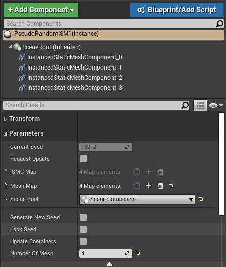

import {
	Footer,
	Alert,
	GifOverlay,
} from "../../../../src/components/Decorations";

---

#### Continued...

In part 2, we **_spawned multiple Instanced components in alternating locations_** using a map of ISMC.

In this part, we are going to add a **_pseudo-random number provider_**.
Also, we will mitigate the issues we faced in last section.

**_NOTE: Also, there were some unresolved errors in last part. I had to revisit my archived projects to fix them. I discussed them down the line_**

This is the content list for this part:

1. Moving the utility functions to `Library.h`.
2. Adding Pseudo-Random provider.
3. Getting the new overlay ready for designer.
4. Playing around with Semi-procedural wall we made.

---

### Moving utility functions

We have to make a new C++ class(empty C++ class) and add these functions.
We only need a header file. You may delete the source(.cpp) file.
The two functions in question are...

#### 1. Cleaning leftover references by type

We used this function to get rid of components that were leftover every time we updated

**_Note: When we create something with NewObject and register it, they don't get removed automatically._**

**_They are probably merely invisible because we forgot to "Attach" them to our Actor/Component._**

The following function will make sure that every such components are destroyed properly.

NOTE: If we have ActorComponent with their own components,
this function would have to be called for them individual basis.

```cpp
// cleanup function
while (this->GetComponentByClass(UInstancedStaticMeshComponent::StaticClass()) != NULL)
{
	UActorComponent *cls = this->GetComponentByClass(UInstancedStaticMeshComponent::StaticClass());
	cls->UnregisterComponent();
	cls->DestroyComponent();
	cls->SetActive(false);
}
```

```cpp{numberLines: false}
// Add this in Library.h

/** Searches all Components "type" for given Actor "any" and destroys them */
template <class any, typename type>
static void cleanComponentsByType(any* reference) {
	while (reference->GetComponentByClass(type::StaticClass()) != NULL) {
		class UActorComponent* cls = reference->GetComponentByClass(type::StaticClass());
		cls->DestroyComponent();
		cls->SetActive(false);
	}
	return;
}
```

[Reference](https://gitlab.com/suvam0451/downtown/blob/master/workspace/Plugins/Dependencies/Source/Dependencies/Public/Libraries/StaticLib.h#L176)

Explanation:

- **_any_**: Child class of AActor.
- **_type_**: `Component` class/subclass to remove _(e.g.- UStaticMeshComponent)_

---

#### 2. Initializing ISMC and map of ISMC

This function would initialize the component. Consider removing lines you would not require based on notes below.

plug-in macro : `uinit_ismc`

```cpp
// Original function

// Declaring ISMC in anywhere other than constructor (uinit_ismc)
My_ISMC = NewObject<UInstancedStaticMeshComponent>(this);
My_ISMC->RegisterComponent();
My_ISMC->AttachToComponent(RootComponent, FAttachmentTransformRules::KeepRelativeTransform);
My_ISMC->SetStaticMesh(My_Mesh);
```

```cpp
// Full implementation in Library.h

// Initialize single ISM
template <class any>
static void ISM_Initialize(ISMC* ref, any* parent, USceneComponent* SceneRoot, SM* sm = NULL) {
	ref->SetFlags(RF_Transactional);
	ref->CreationMethod = EComponentCreationMethod::UserConstructionScript;
	ref->SetMobility(EComponentMobility::Type::Static);
	ref->SetStaticMesh(sm);
	ref->IsRegistered() ? true : ref->RegisterComponent();
	// Use this line in { 4.22, 4.23 }. 4.24 use the lower one.
	// ref->AttachToComponent(SceneRoot, FAttachmentTransformRules(EAttachmentRule::KeepRelative, true));
	ref->AttachToComponent(SceneRoot, FAttachmentTransformRules::KeepRelativeTransform);
	parent->AddInstanceComponent(ref);
}
```

[Reference](https://gitlab.com/suvam0451/downtown/blob/master/workspace/Plugins/Dependencies/Source/Dependencies/Public/Libraries/StaticLib.h#L176)

Explanation:

- **_SetFlags/CreationMethod_**: I have yet to discover these macors. All I can say is that without these, issues start popping up.
- **_SetMobility_**: I design procedural buidlings to be static. Remove if you want dynamism.
- **_AttachToComponent_**: Without this, component will be invisible. (For a blank actor, send `this->RootComponent`)
- **_AddInstanceComponent_**: Goes along with the first point. Errors pop-up without this.

---

### Calling the functions

Assuming our actor class is **_AActor_** and we want to remove **_SplineComponent and InstancedStaticMeshComponent_**, we can use it like this:

**_Now these functions may be called as(after including your headers, of course)_**

```cpp
// To complete our task
WW_Library::cleanByType<AActor, USplineComponent>(this);
WW_Library::cleanByType<AActor, UInstancedStaticMeshComponent>(this);

// Examplw with different actor class
WW_Library::cleanByType<AWW_Brick_Out_01, UPointLightComponent>(this);

// Initializing ISMs (mapping MeshMap --> ISMC_Map)
ISM_Initialize(ISMC_Array[i], this, SceneRoot/RootComponent, MeshMap[i];
```

---

### Adding the RandomStream

We will use the code we had from last part.
We add the following code for a seeded random number stream.

**NOTE: _Full procedural generation has its own places. But we want more control._**

[More about RandomStream in UE4]() _(You can read later)_

[Wiki](https://docs.unrealengine.com/en-US/Engine/Blueprints/UserGuide/RandomStreams/index.html)

The way I implement it, we would expect the designer to put a **_random int_** and fire the generator manually.
For our designer, we will have _a switch_ which **_automatically generates this number_**.
Also, _a switch_ to **_lock the integer_** so we don't accidentally lose it via misclick.

For same integer, result will always be same. This is useful when generating houses and such.

```cpp
// PseudoRandomISM.h
#include "Kismet/KismetMathLibrary.h"

UPROPERTY(VisibleAnywhere, Category = "Parameters")
	int CurrentSeed = 451;
UPROPERTY(EditAnywhere, Category = "Parameters")
	bool GenerateNewSeed = false; // A switch
// Advanced display will keep the prop in a dropdown. Damage prevention 101.
UPROPERTY(EditAnywhere, AdvancedDisplay, Category = "Parameters")
	bool LockSeed = false; // A switch
UPROPERTY(EditAnywhere, Category = "Parameters")
	bool RequestUpdate = false; // A switch
UPROPERTY(EditAnywhere, BlueprintReadWrite, Category="Parameters")
	int NumberOfMesh;

private:
// Description not provided
UFUNCTION(BlueprintCallable, Category = "C++")
	void IndependentFunction();

// Description not provided
UFUNCTION(BlueprintCallable, Category = "C++")
	void ResetMapContainers();

FRandomStream rnd; // I kept it private. Exposing to BP is your choice.
```

```cpp
// PseudoRandomISM.cpp
void ASRandTestActor::OnConstruction(const FTransform &Transform)
{
	if (!LockSeed && GenerateNewSeed)
	{
		CurrentSeed = FMath::Rand();
		GenerateNewSeed = false; // This is a switch
		RegenerateStream(CurrentSeed);
	}
	// switch to generate the structure
	if (RequestUpdate == true)
	{
		GeneratorBody();
		RequestUpdate = false;
	}
	// switch to update map sizes
	if (UpdateContainers == true)
	{
		ResetMapContainers();
		UpdateContainers = false;
	}
}
void ASRandTestActor::StartDesigner()
{
	// Not implemented
}
void ASRandTestActor::ResetMapContainers()
{
	// Not implemented
}
```

RECAP : There are 2 switches, one boolean for flow control, and an exposed parameter for number of meshes.

This time around, we are not saving the mesh references temporarily. It was done in 2nd part.
Code is simpler to grasp in this way.

However, the source code for the 4th example should have everything implemented for reference.



At this point, you should have an UI like the above.

- ISMC Map is read only (`uprop_ismc_ro`)
- **_Generate new Seed_** randomizes te seed integer
- **_Request Update_** calls our designer function _(Remember about pitfalls of designing in OnConstruct)_
- **_Lock seed_** invalidates **_Generate New seed_**.
- Changing number of meshes will update the maps _internally_ when **_Request Update_** is pressed.

Also, we added 2 private functions corresponding to two switches.
We discussed about utility of switches in last part.

- `StartDesigner()` evaluates the integer seed, meshmap values and generates the structure.
- It is called by the `RequestUpdate` switch
- `ResetMapContainers()` evaluates NumberOfMesh and sets the map for input.
- It is called by `UpdateContainers`
- Functionality to save previous mesh data to temporary map should be done in UpdateContainers
  (again, its in 4th example for reference)

Next up we implement the functions.

We demonstrate picking between 2 values via RandomStream.
Expanding this to multiple meshes is a simple math problem.

**_(The extra example will evaluate the mesh based on weight we assign to it)_**

```cpp{7}
// PseudoRandomISM::StartDesigner()

// Utility fuc to safely free dangling components
WW_Library::cleanByType<APseudoRandomISM, UInstancedStaticMeshComponent>(this);
// Cleans arrays
WW_Library::cleanMap<UInstancedStaticMeshComponent>(ISMC_Map);
// WW_Library::cleanMap<UStaticMesh>(MeshMap) wont work. They are not Registered
// MeshMap.Empty(); // This is enough to cler references
// Utility func to safely initialize ISM maps.
WW_Library::ISM_RefreshByNumber(ISMC_Map, NumberOfMesh, this, SceneRoot);
// Maps our meshes to their respective containers
WW_Library::Map_MeshToISMC(ISMC_Map, MeshMap);
for (int i = 0; i < ISMC_Map.Num(); i++)
{
	ISMC_Map[i]->AddInstance(FTransform(FVector(100.0f * i, 0, 0)));
}
```

[Reference](winterwildfire.netlify.com)

Explanation:

- We clean all attached components.
- Cleaning the maps. Using cleanMap to revocate references as well.
- Utility function to initialize ISMs. Useful upgrade over the for loop.
- You can use `uinit_ismc` to generate this code.
- `Map_MeshToISMC` maps the meshes 1 to 1.
  The function would account for size mismatch and ArrayIndexOutOfBounds errors.

```cpp
// PseudoRandomISM::ResetMapContainers()

// Adding dummy values to MeshMap
MeshMap.Empty();
for (int i = 0; i < NumberOfMesh; i++)
{
	MeshMap.Add(i);
}
```

[Reference](winterwildfire.netlify.com)

**_Explanation_** : We observed in previous part that we can't increment mesh references from the editor.
This is the straight-forward implementation in C++.

### Check-In

Unfortunately, the post got too long, so I decided to continue this in the next part.

If we now go and add four static meshes into the array, we should get the following.

Just for you to follow, the steps are:

- Set number of mesh to 4. Press _Update Containers_
- Play around with seed generation and locking.
- _Request update_ should spawn the meshes in a line.

This sets the field.
Next part will focus on getting something built in the **_StartDesigner()_** code section.

Make sure you followed through how the rest of the system is set-up to work.
You can choose your own but this setup lets me quickly iterate through my procedural buildings.

See you later.
