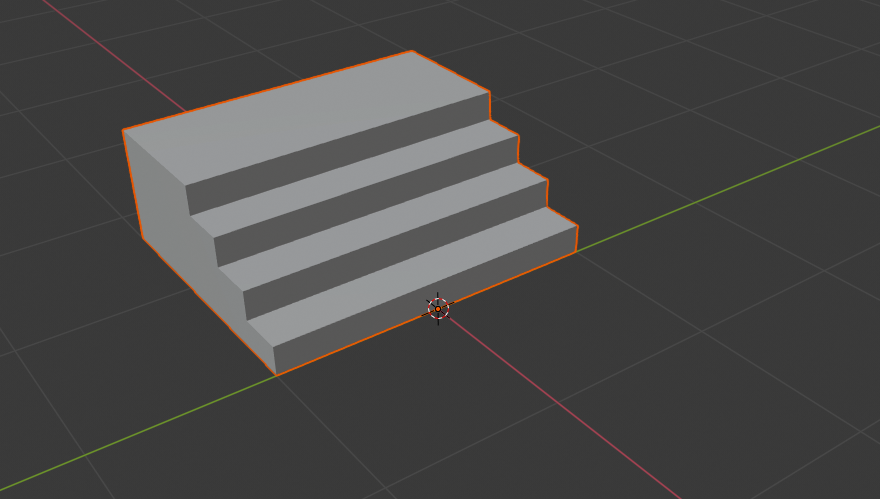
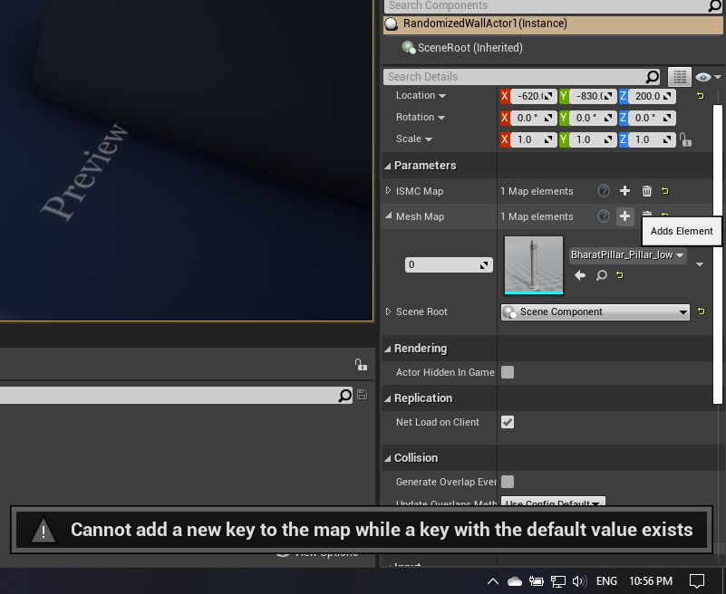
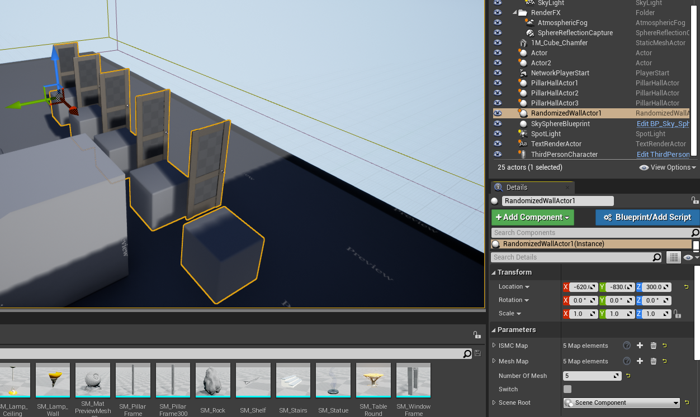
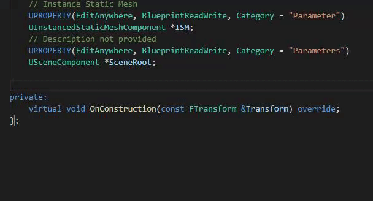
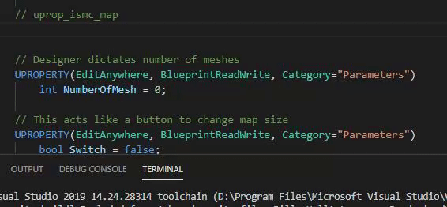
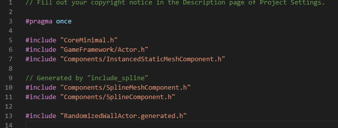

import {
	Footer,
	Alert,
	GifOverlay,
} from "../../../../src/components/Decorations";

In the previous part, we were introduced to Instanced Static Meshs Components (ISMC) and how to makeone spawn in C++ without issues.
In this part, we will use a map of ISMC to randomly populate a wall/fence.

To build a fence, we would need (I would provide for this tutorial):
- At least 2 models.
- The models must span along +ve X direction, starting at one corner-edge. *(Refer image below for modelling)*
- Planning ahead, the length of subunits.



We already have the code for one ISMC, we just need a map here.

```cpp
// RandomizedWallActor.h (Better remove Tick/BeginPlay if not using.)
public:
	// Map of ISMC 
	UPROPERTY(EditAnywhere, BlueprintReadWrite, Category="Parameters")
		TMap<int, UInstancedStaticMeshComponent*> ISMC_Map;

	// This is our map of meshes which would be used in ISMC Map 
	UPROPERTY(EditAnywhere, BlueprintReadWrite, Category="Parameters")
		TMap<int, UStaticMesh*> MeshMap;

private:
	// Description not provided
	UPROPERTY(EditAnywhere, Category = "Parameters")
	USceneComponent *SceneRoot;

	virtual void OnConstruction(const FTransform &Transform) override;


// RandomizedWallActor.cpp

ARandomizedWallActor::ARandomizedWallActor()
{
 	// Set this actor to call Tick() every frame.  You can turn this off to improve performance if you don't need it.
	PrimaryActorTick.bCanEverTick = true;
	
	// The reason we need this was covered in last part. 
	SceneRoot = CreateDefaultSubobject<USceneComponent>("SceneRoot");
	RootComponent = SceneRoot;
}

void ARandomizedWallActor::OnConstruction(const FTransform &Transform)
{
	// Cleanup
	while (this->GetComponentByClass(UInstancedStaticMeshComponent::StaticClass()) != NULL)
	{
		UActorComponent *cls = this->GetComponentByClass(UInstancedStaticMeshComponent::StaticClass());
		cls->UnregisterComponent();
		cls->DestroyComponent();
		cls->SetActive(false);
	}

	for(int i = 0; i < MeshMap.Num(); i++) {
		ISMC_Map.Add(i, NewObject<UInstancedStaticMeshComponent>(this));
		ISMC_Map[i] = NewObject<UInstancedStaticMeshComponent>(this);
		ISMC_Map[i]->RegisterComponent();
		ISMC_Map[i]->AttachToComponent(RootComponent, FAttachmentTransformRules::KeepRelativeTransform);
		ISMC_Map[i]->SetStaticMesh(MeshMap[i]);
	}
}
```

Okay, few things to note:
- We have to populate **_ISMC_Map_** according to  **_MeshMap_** before.
- If we have more boxes than we have balls, we will get a OutOfIndex exception. You get the idea.
- We covered **_cleanup_** last time. Next time, we will put that into its own function.

---

### Making the system designer friendly
Okay, you are in the editor. Everything *should* work, but it doesn't. You can see the problem below.



**_Q: You have two hands full. You want to replace new item in one hand but can't drop any item. What do you do ?_**
You ask a friend to hold onto the item. Basically, ue4 is warning that a refresh will wipe your mesh reference(Map will be back to zero element).

We should actually not mess with adding/removing items directly. Lets make a function for that. At this point, it is better to give the designer **_an integer_** instead of this Map mess.

```cpp
// Added to RandomizedWallActor.h
	// Designer dictates number of meshes
	UPROPERTY(EditAnywhere, BlueprintReadWrite, Category="Parameters")
		int NumberOfMesh = 2;

	// This acts like a button to change map size  
	UPROPERTY(EditAnywhere, BlueprintReadWrite, Category="Parameters")
		bool Switch = false;

	// Updates the map size. TRIES to recover the previous values 
	UFUNCTION(BlueprintCallable, Category="C++")
		void UpdateMapSize();
```
```cpp
// function declared in RandomizedWallActor.cpp
	void ARandomizedWallActor::OnConstruction(const FTransform &Transform) {
		// This will switch the function we made
		if (Switch = true) {
			UpdateMapSize();
			Switch = false;
		}
		// Rest of the code
	}

void ARandomizedWallActor::UpdateMapSize()
{
	// Copy the cleanup code here (Otherwise your ISMC Map will have different size. Not game-breaking but annoying.)
	// We don't need to nuke the references for MeshMap. They haven't used RegisterComponent();

	// The old switcharoo...
	TMap<int, UStaticMesh*> TemporaryMeshMap;
	TemporaryMeshMap = MeshMap;
	MeshMap.Empty();

	for(int i = 0; i < NumberOfMesh; i++) {
		MeshMap.Add(i, NewObject<UStaticMesh>(this));
	}

	// Attempt to recover the references.
	for(int i = 0; i < TemporaryMeshMap.Num(); i++) {
		if(i< MeshMap.Num()){
			MeshMap[i] = TemporaryMeshMap[i];
		}
	}

	// Kill the temp object( This is done automatically. Leaving it here to spread the good habit.)
	TemporaryMeshMap.Empty();
}
```

Few things to note here. Lets say your designer initially has 5 meshes set. If he changes the value to 3 and hits the button, 2 references will have to be readded.
- Its an easy fix but probably not worth it. You should know how many mesh you need.
- Pressing the boolean switch refreshes the maps. Moving the object fires OnConstruction. pretty neat, right ? I always use this workflow.
- Next important thing, you don't want that ISMC_Map to be editable in the first place. It should be completely covered in C++/Blueprints

```cpp
	// Completely hidden (Macros also optional. 
	// If its an UObject not allocated via NewObject, you are good to go with ignoring macros and going vanilla C++)
	UPROPERTY()
		TMap<int, UInstancedStaticMeshComponent*> ISMC_Map;

	// ReadOnly. Will appear greyed out in details panel. If you use my plug-in, "uprop_ro" outputs this
	UPROPERTY(VisibleAnywhere, Category="XYZ")
		TMap<int, UInstancedStaticMeshComponent*> ISMC_Map;
```

That was very long for getting the basic system in place. Trust me, it obliterates your mind when things don't spawn as ou expect. Next up, alternately spawning meshes.

---

#### Organizing groups of ISMC

Already covered spwaning ISMC last time. Add this to make them alternate.
```cpp
// Added to RandomizedWallActor.h (OnConstruction)
	if(MeshMap.Num() >=2){
		for(int i = 0; i < 10; i++) {
			if(i%2==0 && (ISMC_Map[0]->GetStaticMesh() != nullptr)){
				ISMC_Map[0]->AddInstance(FTransform(FVector(100.0f* i, 0,0)));
			}
			else if(ISMC_Map[0]->GetStaticMesh() != nullptr){
				ISMC_Map[1]->AddInstance(FTransform(FVector(100.0f* i, 0,0)));
			}
		}
	}
```

Next up we want the spawning to be procedural and **_respect the lengths_** we give per mesh object. That, we shall cover in the next part. 
It's been a lot of exercise and I am sure some bug might pop up from older engines at this point. Also, we will be moving some repeating code to their own functions.

---

#### Check-In

Make sure you have something like this going for you.

If you did the alternating exercise, you should have something like this.



If you skipped, make sure to check back with the **_cleanup codes_** and colored sections. They will be useful if you are stuck.

In the next segment, we will add a pseudo random generator and implement the length criteria. Then we will refactor the code to make it more clean and that will be all for a ISM basic.
I will continue to make advanced tutorials, but this series will be listed as a dependency before going through that. See you in next part.

---

#### (~~Promo~~) My VSCode plug-in

You can use `uprop` to create public properties. `uprop_ro` to create readonly properties.



Also, snippets for code we are going to use a lot in this series. Below shown `uinit_ismc_map`. There are similar snippets for MeshMap and similar used in rapid procedural prototyping in C++.



You can also get a set of headers included without looking up docs (`include_procedural`, `include_spline`)

