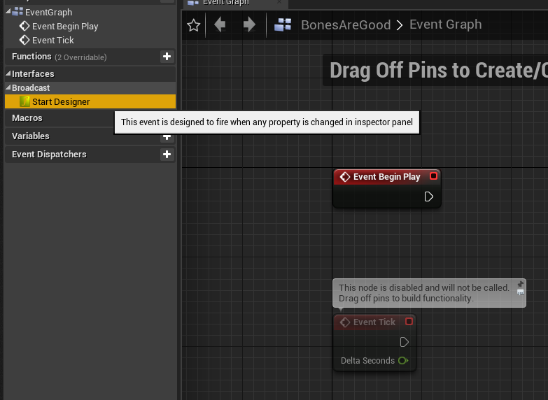
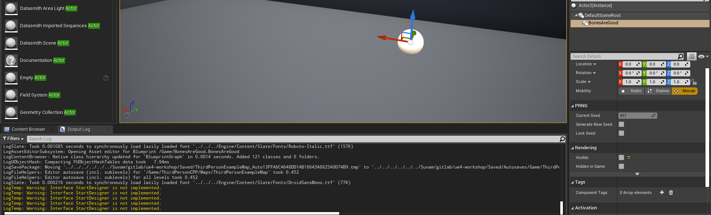
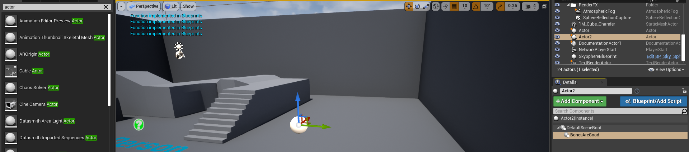

import { Footer, Alert } from "../../../src/components/Decorations";

In this very first series, we will discuss how to make C++ code available to blueprint. Reason for this is, most users of the engine are designers and Blueprint is more convenient to work with in general.
Some reasons when you might want not to use blueprint for everything are :
- Expensive algorithms are slower in blueprint *(Highly unlikely)*
- Source code is easier to **share** and **maintain** *(This is the major reason why knowing a bit of C++ goes a long way)*

As we will see, with a few lines of interface code, we can make the end designer/developer more comfortation with code written by us.
Moreover, the code can be further modified by either C++/Blueprints without breaking core design.

### Native C++ Interface
---

Interfaces are used to template our logic. Forcing everyone derive from interfaces makes sure everyone is on the same page when it comes to logic.

**I want my C++ ActorComponent to do something everytime my designer changes any property from side-panel. How can I do that ?**

First, define a UObject from `Content Browser`-> `Right Click` -> `New C++ Class` -> `Object`
Modify as shown below:
- Make it derive from *UInterface*. Don't forget *UINTERFACE()* macro
- Add an extra class with *I* prefix which houses all your functions.
- Don't forget to comment out what the function does. That is very important.

<Alert
	head="What does BlueprintNativeEvent do ?"
	body="BlueprintNativeEvent makes the function able to be overridden in C++ OR BP."/>

```cpp
#include "CoreMinimal.h"
#include "UObject/NoExportTypes.h"
#include "YourInterface.generated.h"

//////////////////////////////////////////////////////////////////////
// UYourInterface.h

UINTERFACE()
class XYZ_API UYourInterface : public UInterface
{
	GENERATED_BODY()
};

class XYZ_API IYourInterface
{
	GENERATED_BODY()
public:
	// This event is designed to fire when any property is changed in inspector panel
	UFUNCTION(BlueprintCallable, BlueprintNativeEvent, Category = "Overrides")
	    void StartDesigner();
};
```

After that, we need an ActorComponent to implement this Interface, the header looks like the code below where:
- `PostEditChangeProperty` is an override that gets fired when you change values in details tab.
- Deriving SceneComponent because ActorComponent by itself *can't be placed in the world*.
- Add the last 3 lines as they are *(explained below code)*.

```cpp
#include "CoreMinimal.h"
#include "Components/ActorComponent.h"
#include "Components/SceneComponent.h"
#include "UYourInterface.h" // dont forget this..
#include "YourSceneComponent.generated.h"

//////////////////////////////////////////////////////////////////////
// UYourSceneComponent.h

UCLASS(Blueprintable)
class XYZ_API UYourSceneComponent : public USceneComponent, public IYourInterface
{
	GENERATED_BODY()

public:
	UYourSceneComponent();
private:
	// Called when any component property is modified in inspector
	virtual void PostEditChangeProperty(FPropertyChangedEvent &PropertyChangedEvent) override;
public:
	UFUNCTION(BlueprintCallable, BlueprintNativeEvent, Category = "Broadcast")
	    void StartDesigner(); 
	virtual void StartDesigner_Implementation() override; 
}
```

So, the first `StartDesigner()` confirms that the interface has been implemented. Without this, 
some bonus functionalities like checking whether a class implements a given function won't work.
But we don't need a body for this. (No definition needed in C++, 
although you can add some default functionalities in UYourInterface.cpp **(not recommended)**)

The second `XYZ_Implementation()` function is the one we need a body for.
Put the following in source file, we will be switching to Editor next. 

```cpp
//////////////////////////////////////////////////////////////////////
// UYourSceneComponent.cpp (Leave rest of auto generated code, as is.)

void UWW_BaseSceneComponent_PRNG::PostEditChangeProperty(FPropertyChangedEvent &PropertyChangedEvent)
{
	Execute_StartDesigner(this);
}
void UYourSceneComponent::StartDesigner_Implementation()
{
	UE_LOG(LogTemp, Warning, TEXT("Interface StartDesigner is not implemented."));
}
```

Open the editor, and right click on the newly created C++ class and make a blueprint. This is how it should look like.
Some observations:
- Your special functions with detailed description is neatly arranged on left panel.
- The designer doesn't have to mess with PostEditChangeProperty/Underlying code.
- Bonus points for no sphaghetti and Version Control.



Time to test this out. Drop an empty actor to world and attach this blueprint to it from the details tab. Now, change ANY property (It must be of the component, not the actor).
You should get the following.



Good to go ? Next go to that blueprint we created. Right click on the function -> `Implement function`. Now drag as pin and print yourself something.
You should get the following.



#### Observations
- C++ Interfaces provide a tangle free way to expose parts of code to designer.
- This abstraction is an improvement over direct use of PostEditChangeProperty/BeginPlay in the blueprint. This is we want to reuse code and keep scalability in mind.
- You might've guessed, but this works for plug-ins too. Make a base module with parent classes/ couple them with respective interfaces. 
Show the designer your interfaces only and he's good to go.

#### Next Up

Next, we are going to define interfaces in C++ and use initialize them in blueprints. Not the best approach but something to keep in mind (The above approach is what we will be doing 90% of time).
If you are satisfied with this, skip to [page 3](/tutorials/ue4/interfacing-cpp-and-blueprints-3) where we will be making a **reusable health system using interfaces** using this approach.