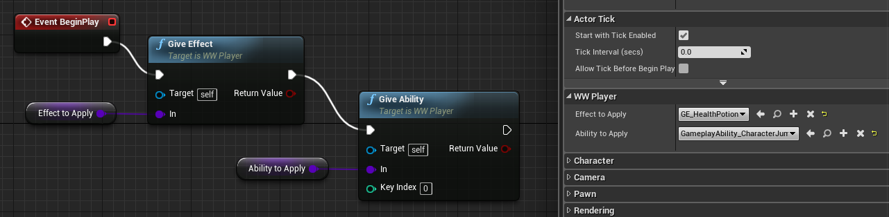

import { Footer, Alert } from "../../../src/components/Decorations";

<Alert
	head="Why not hard code enums ?"
	body="The amount of code becomes worth it for larger MMOs/RPGs with switchable skills everywhere."
/>

---

#### Summary
So, that was the minimum amount of work done to get some ability switching going on.
In the next section, we would see how Epic does some extra stuff in the demo.
As we will see, the amount of investment into this plug-in will vary project to project.
But breaking down important parts will help us pick the features we need.