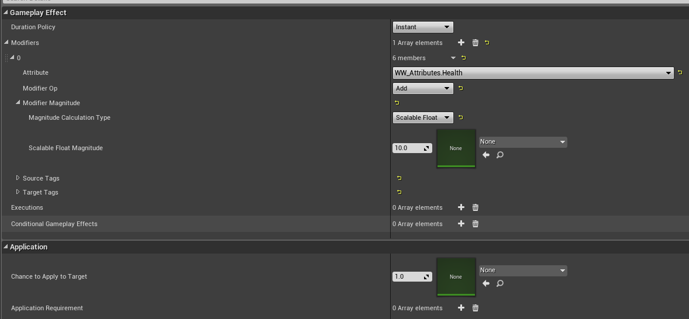
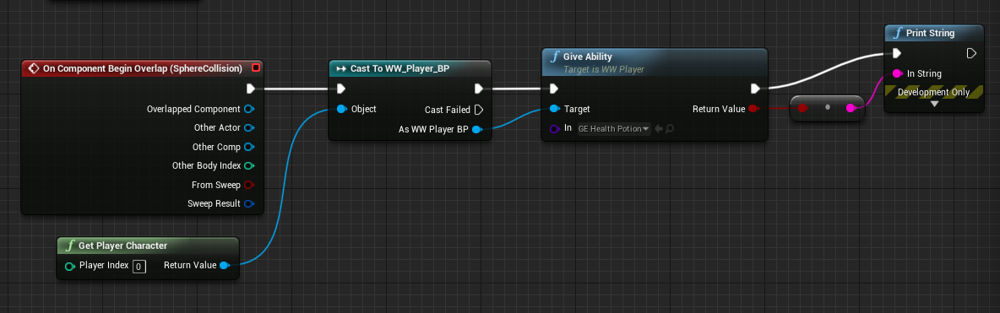

import { Footer, Alert } from "../../../src/components/Decorations";

### About
---
Okay, when I started with Gameplay Ability System, it was way too huge and seemed totally unnecessary.
There is a super high chance that one would never need most of those features. +
However, since a full blown framework to design data driven gameplay already exists,
I will save myself(and my visitors) some trouble.

#### Gameplay Effect System
###### Components and Map
---

First thing first, There are too many classes involved.
Let's first make a `dependency graph` so that progress down the linear follows our pattern.

Glimpsed well ? Let's tackle the classes one at a time. *(I love graphs. Hope you do, too.)* 

##### Step 0. GameplayAttributeData

This class **declares parameters**. The signature can be summed up to

- `Current` and `base` value pair.
- #C++ only Getters# and #overrideable setters#, totalling 4 relevant functions.
- Two self explanatory constructors
- GameplayAttributeData() defaulting to zero for the value pair.
- GameplayAttributeData(float val) 

What the signature of the 


=== Step 1. Create an AttributeSet
Since this class has #no cross dependencies#, we start with this. It was very difficulty to comprehend at first. The trick is in the macro definition and let me #do the homework for C++ devs# who just want to get up and ready .

```cpp
// Uses macros from AttributeSet.h
#define ATTRIBUTE_ACCESSORS(ClassName, PropertyName) \
	GAMEPLAYATTRIBUTE_PROPERTY_GETTER(ClassName, PropertyName) \
	GAMEPLAYATTRIBUTE_VALUE_GETTER(PropertyName) \
	GAMEPLAYATTRIBUTE_VALUE_SETTER(PropertyName) \
	GAMEPLAYATTRIBUTE_VALUE_INITTER(PropertyName)
```

Will expand to following functions
```cpp
static FGameplayAttribute Get##PropertyName##Attribute() {
	static UProperty* Prop = FindFieldChecked<UProperty>(ClassName::StaticClass(),GET_MEMBER_NAME_CHECKED(ClassName, PropertyName));
	return Prop;
}
FORCEINLINE float Get##PropertyName() const {
	return PropertyName.GetCurrentValue();
}
FORCEINLINE void Set##PropertyName(float NewVal) {
	UAbilitySystemComponent* AbilityComp = GetOwningAbilitySystemComponent(); \
	if (ensure(AbilityComp)) {
	    AbilityComp->SetNumericAttributeBase(Get##PropertyName##Attribute(), NewVal); \
	};
}
FORCEINLINE void Init##PropertyName(float NewVal) {
	PropertyName.SetBaseValue(NewVal);
	PropertyName.SetCurrentValue(NewVal);
}
```
All we need to know from these functions is that, for every
```cpp
/** Current Health, when 0 we expect owner to die. Capped by MaxHealth */
UPROPERTY(BlueprintReadOnly, Category = "Health", ReplicatedUsing = OnRep_Health)
	FGameplayAttributeData Health;
ATTRIBUTE_ACCESSORS(UWW_Attributes, Health)
```
We get the following functions added automatically
[%header,cols=3*]
|===
| Function
| What it does
| Important to note

| FGameplayAttribute *GetHealthAttribute()*;
| #Gets# the data for given attribute.
|- Used in attribute evaluation as in pre-processing and post-processing data.

| float *GetHealth()*;
| #Gets# `current` health.
| N/A

| void **SetHealth(**float NewVal**)**;
| #Sets# `base` attribute
| N/A

| void **InitHealth(**float NewVal**)**;
| Used to #initialize# to full hp with #no modifiers#.
| Both `Base` and `Current` values are set. 

|===

TIP: `GET_MEMBER_NAME_CHECKED` Returns FName. Its part of assertion macros.

There are two overrides that do pre and post processing on data
	
```cpp
virtual void PreAttributeChange(const FGameplayAttribute& Attribute, float& NewValue) override;
virtual void PostGameplayEffectExecute(const FGameplayEffectModCallbackData& Data) override;
```
* Preattribute was used in ARPG to rescale the health and stamina bars.
* PostGameplayEffectExecute was used to passed handling onto the Character class. Although, any persistent UObjects will also get the job done, if you want more code isolation. Possible candidates are #GIS#, #GM#, #PlayerController# etc.

=== Step 2: FGameplayModifierEvaluatedData

The next thing we #should# deal with is the data we can get from `FGameplayEffectModCallbackData` in #PostGameplayEffectExecute# since that's where effects are applied.

WARNING: - This segment is not needed to get a basic AttributeSet running. +
         - This is for advanced use cases. If you are new, please skip to next section

Signature of `FGameplayModifierEvaluatedData` has 
```cpp
const struct FGameplayEffectSpec&	EffectSpec;		// The spec that the mod came from
struct FGameplayModifierEvaluatedData&	EvaluatedData;	// The 'flat'/computed data to be applied to the target
class UAbilitySystemComponent &Target;		// Target we intend to apply to

```
TIP TLDR: A source, a destination and a payload. 

We are more interested in `FGameplayModifierEvaluatedData` obtained by #FGameplayModifierEvaluatedData.*EvaluatedData*#

Signature is

```cpp
FGameplayAttribute Attribute; // Attribute from target UAttributeSet that was changed
TEnumAsByte<EGameplayModOp::Type> ModifierOp; // Added? / multiplied?
float Magnitude; // Delta before clamp
FActiveGameplayEffectHandle	Handle; // Handle to GE. Invalid in most cases as mentioned by epic
bool IsValid; // safety checks
FString ToSimpleString() const // Will give FName, ModifiedOp mode, Delta in that order
```

Beyond this, for simplest single player games, we do #minor tweaking# and #pass data# onto whoever handles the methods we created in that Step 1 complex macro. +
#Take the code lightly#, if you are starting out. try casting to your custom Actor, Controller, Character and running test scripts in their body. The next section will clear up what needs to be done on your #character side#.

=== Step 3. 

On player side, we have to implement the `IAbilitySystemInterface` . Lets say that we had #one attribute(health)# in our AttributeSet derived class, ARPG implements the following two functions
```cpp
// This has to be implemented in BP
UFUNCTION(BlueprintImplementableEvent)
	void OnHealthChanged(float DeltaValue, const struct FGameplayTagContainer& EventTags);

// Called from RPGAttributeSet, these call BP events above
virtual void HandleHealthChanged(float DeltaValue, const struct FGameplayTagContainer& EventTags);

// Friended to allow access to handle functions above
friend URPGAttributeSet;
```

This is where we skip the Blueprint part and reduce our code for some scalability later. +
So for us, the section will look like
```cpp
// Called from OurAttributeSet, these are handled by us natively in C++
virtual void HandleDamage(float DamageAmount, const FHitResult& HitInfo, const structFGameplayTagContainer& DamageTags, ARPGCharacterBase* InstigatorCharacter, AActor*DamageCauser);
virtual void HandleHealthChanged(float DeltaValue, const struct FGameplayTagContainer&EventTags);
virtual void HandleManaChanged(float DeltaValue, const struct FGameplayTagContainer&EventTags);
virtual void HandleMoveSpeedChanged(float DeltaValue, const structFGameplayTagContainer& EventTags);

// Friended to allow access to handle functions above
friend URPGAttributeSet;
``` 

For your future reference, this snippet routed the logic in ARPG
```cpp
// Native C++ class
void ARPGCharacterBase::HandleHealthChanged(float DeltaValue, const struct FGameplayTagContainer& EventTags)
{
    // We only call the BP callback if this is not the initial ability setup
    if (bAbilitiesInitialized)
    {
	// Blueprint event
	OnHealthChanged(DeltaValue, EventTags);
    }
}
```

I had a very hard time getting `FGameplaySpecHandle` and few other structs in BP, so I would definitely #recommend handling GAS logic in C++#. +
Next, I would like you to add __a public variable__ and __a function__. These will be used to assign effects directly from BP. 

##### The public variable

First, the **public variable**. (Later, we might create our own parent class.)
But if you give it incorrect input then the cast will fail.
Since we start from scratch, we are safe with the folowing.

```cpp
// Basic demo for a single ability (Using class reference)
TSubclassOf<UGameplayEffect> OneEffect;
// Extra info : Instanced classes would be passed like this.
TArray<UGameplayEffect*> OneEffect;
// Later on tutorial, we will use arrays like these to insert multiple class references
TArray<TSubclassOf<UGameplayEffect>> EffectArray;
```

##### The function

This will grant the effect to our pawn. Fow now we want to do handle all logic in C++.

```cpp
void GiveAbility(TSubclassOf<UGameplayAbility> In) {	
    FGameplayEffectContextHandle EffectContext = AbilitySystemComponent->MakeEffectContext();
    EffectContext.AddSourceObject(this);
    // We set the level to 1 here for simplicity
    FGameplayEffectSpecHandle NewHandle = AbilitySystemComponent->MakeOutgoingSpec(In, 1, EffectContext);
    if (NewHandle.IsValid()) {
	FActiveGameplayEffectHandle ActiveGEHandle = AbilitySystemComponent->ApplyGameplayEffectSpecToTarget(*NewHandle.Data.Get(), AbilitySystemComponent);
    }
}
```

---

Great, we are done here. Time to boot up the editor and add an effect.
We derive from the normal GameplayEffect class. Try to brew a potion like this



These are the fields we have learnt so far. Add 10 HP flat to `Health` attribute of `WW_Attributes`(My UAttributeSet derived class) +
And next create a triggerbox/sphere BP and have it do this. #GiveAbility# was the function name I chose.



#Does it work# ? Great!!! #Does it not# ? DEBUG(Ill add later promise)!!! But, if you recall, we hard coded the level and input etc. That's why we have the GameplayEffect blueprints. It gives us the flexibility and scaling system using curves. More on that later. +
We have a working `GameplayEffect` system and its time to build a working `GameplayAbility` system.

== Gameplay Ability System

There is broad use cases of the ability System. +
At a basic level it can make your ability buttons do different things. +
This means we can let a #bunny hop#, a #bird flap its wings#, an #alligator chomp# pressing the same button depending on which charcter is available to us. +
Also, it seems the way to do this is surprisingly simple. +

Create a class derived from UGameplayAbility. we will understand the dash ability that comes with the plug-in as sample. #Hands off keyboards and eyes on screen#, please.


The full list of functions can be seen in the UGameplayAbility class.
The ones that you might want to look-out for are :-

- **InputPressed:** Called when the key is pressed (Given that the ability is granted to the player)
- **InputReleased:** Called when the key is released (Given that the ability is granted to the player)

`ActivateAbility` will firstly commit the ability (meaning spend the resources) and then depending on if the commit was successful, do the next listed commands. We can stack our gameplay logic here like this.


TIP: I know that I am skipping a lot of network stuff. But, it is #outside my scope# and the #authority checks will always return true# for a single player game. Just #letting the functions stay# so that people coming from ARPG #won't get confused#.

Next, #add another BP exposed variable# of type `TSubclassOf<UGameplayAbility>`  to the player class. +
Now you can activate those abilities like this.

---
This will make the player jump only if you granted him the ability.

```cpp
void GiveAbility(TSubclassOf<UGameplayAbility> In, int KeyIndex) {
    /* This function is one of the ways to give ability. Params are
     *  @1 : The class reference
     *	@2 : Level. Lets set it to one for simplicity
     *	@3 : Key binding. set it to zero. Well discuss this later
     *	@4 : One of the extra constructor param. Will be covered later.
     */
    AbilitySystemComponent->GiveAbility(FGameplayAbilitySpec(In, 1, KeyIndex, this));
}
```

---

### Checkpoint
Please check that you got the following stuff running without errors

(Heres the code upto now...)

A player class that has/does (Refer following images)

1. Implements the *IAbilitySystemInterface*.
2. Has an instance deriving from *UAbilitySystemComponent*.
3. Has an instance deriving from *UAttributeSet*. *(This should have only health fields for now.)*
3. Has **two variables** and **two functions** that look like the following.


Great. And as you can see, we can apply effects and arrays like the following.